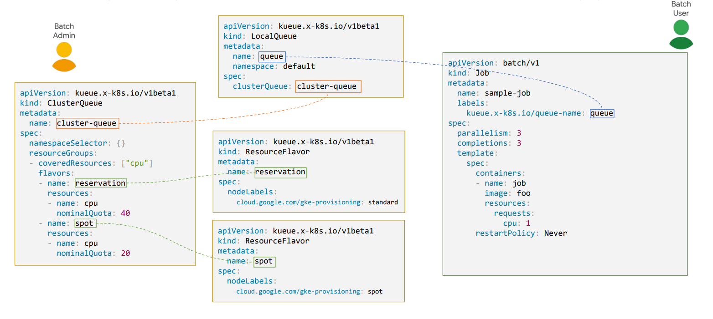
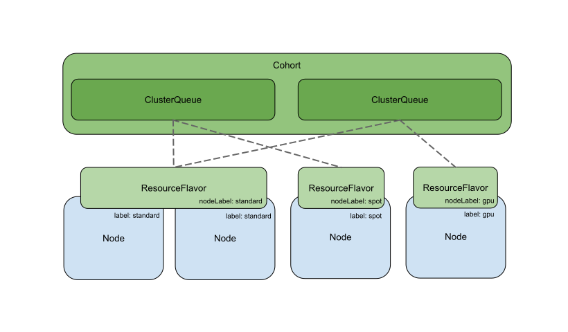

# Kueue

## Overview
Kueue 是一个 kubernetes 原生系统，用于管理 quotas 以及 jobs 如何消耗 quotas。Kueue 决定 job 什么时候应该等待、什么时候应允许 job 启动（如创建 pod ）以及 job 什么时候应该抢占作业（如删除活动pod）。

## Why Kueue
- 通过 borrowing 和 preemption 语义来达到资源配额管理
- 在异构集群内资源可互换
- 支持  k8s batch/v1.Job 和 kubeflow’s MPIJob
- 支持自定义 job CRDs 通过 Extension points 和 Libraries


## APIs



### Resource Flavor
Resource Flavor 可以表示多个资源（异构或同构），并且允许你把它们和集群节点联系起来（通过 labels 和 taints）

- 例子
    ```
    apiVersion: kueue.x-k8s.io/v1beta1
    kind: ResourceFlavor
    metadata:
        name: "spot"
    spec:
        nodeLabels:  # 用于匹配node
            instance-type: spot
        nodeTaints:  # 污点，和 node 的 Taints 用法一致
          - effect: NoSchedule
            key: spot
            value: "true"
    ```

    如果资源是同构的,就可以创建 Empty ResourceFlavor：

    ```
    apiVersion: kueue.x-k8s.io/v1beta1
    kind: ResourceFlavor
    metadata:
    name: default-flavor
    ```

### Cluster Queue
Cluster Queue 用于管理资源（Resource Flavor），定义使用限制和公平共享规则。ClusterQueue 是集群范围的组件，用于管理资源，例如：pods，CPU，memory等

- 例子
    ```
    apiVersion: kueue.x-k8s.io/v1beta1
    kind: ClusterQueue
    metadata:
        name: "cluster-queue"
    spec:
    namespaceSelector: {} # match all.
        resourceGroups:
          - coveredResources: ["cpu", "memory", "pods"]
            flavors:
              - name: "default-flavor"
                resources:
                    - name: "cpu"
                    nominalQuota: 1  
                    - name: "memory"
                    nominalQuota: 1Gi
                    - name: "pods"
                    nominalQuota: 3
    ```



- Resources
    - Cluster Queue 可以定义资源的配额（CPU, memory, GPUs, pods 等等）
    - 可以给不同的 flavor 设置不同的配额

- Resource Groups
    - 可以设置 Resource Groups 将资源分成多类

        ```
        apiVersion: kueue.x-k8s.io/v1beta1
        kind: ClusterQueue
        metadata:
            name: "cluster-queue"
        spec:
            namespaceSelector: {} # match all.
            resourceGroups:
              - coveredResources: ["cpu", "memory", "pods"]
                flavors:
                  - name: "spot"
                    resources:
                      - name: "cpu"
                        nominalQuota: 0.5
                      - name: "memory"
                        nominalQuota: 0.5Gi
                      - name: "pods"
                        nominalQuota: 2
                  - name: "on-demand"
                    resources:
                      - name: "cpu"
                        nominalQuota: 1
                      - name: "memory"
                        nominalQuota: 0.5Gi
                      - name: "pods"
                        nominalQuota: 2
              - coveredResources: ["gpu"]
                flavors:
                  - name: "vendor1"
                    resources:
                      - name: "gpu"
                        nominalQuota: 1
                    - name: "vendor2"
                    resources:
                      - name: "gpu"
                        nominalQuota: 1
        ```

### Local Queue
Local Queue 是一个在 namespace 下的queue。它只能在一个 namespace 下。一个 LocalQueue 指向一个 ClusterQueue ，从中分配资源去运行 Workloads。

- 例子：
  
    ```
    apiVersion: kueue.x-k8s.io/v1beta1
    kind: LocalQueue
    metadata:
        namespace: team-a 
        name: team-a-queue
    spec:
        clusterQueue: cluster-queue 
    ```

- 用户提交 jobs 到 LocalQueue 而不是直接到 ClusterQueue。
    
    租户通过在他们的 namespace 中列出 local queues 可以发现哪些 queues 他们可以提交 jobs。
    ```
    kubectl get -n my-namespace localqueues
    # 也可以使用  `queue` 或 `queues`
    kubectl get -n my-namespace queues
    ```

### Workload
Workload 是一个应用，它会运行到完成。它是 Kueue 中 admission 的单位。Workload 由一个或多个 pods 组成

- 例子：
    ```
    apiVersion: kueue.x-k8s.io/v1beta1
    kind: Workload
    metadata:
        name: sample-job
        namespace: team-a
    spec:
        queueName: team-a-queue
        podSets:
          - count: 3
            name: main
            template:
                spec:
                    containers:
                      - image: gcr.io/k8s-staging-perf-tests/sleep:latest
                        imagePullPolicy: Always
                        name: container
                        resources:
                            requests:
                                cpu: "1"
                                memory: 200Mi
                    restartPolicy: Never
    ```

- queueName
  
    指明 Workload 进入哪一个 LocalQueue

- podSets
    
    Workload 可以由多个 pods 组成，就会有多个 podSpec 需要声明

- priority

    通过在 `.spec.priority` 中指定对应的 PriorityClass 来设置优先度

## 功能
### 1. 资源分配
- ClusterQueue 中可以设置对资源的设置
  ```
  ...
  spec:
    cohort: all-teams
    resourceGroups:
    - coveredResources: ["cpu"]
      flavors:
      - name: default
        resources:
        - name: cpu
          nominalQuota: 40
  ```
  - `nominalQuota`: 资源量

### 2. 优先级和抢占
- **Case 1**: 有两个 ClusterQueue (team-a-cq & team-b-cq) 在同一个 cohort, yaml 中设置了 `borrowingLimit`
  ```
  apiVersion: kueue.x-k8s.io/v1beta1
  kind: ClusterQueue
  metadata:
    name: team-a-cq
  spec:
    cohort: all-teams
    resourceGroups:
    - coveredResources: ["cpu"]
      flavors:
      - name: default
        resources:
        - name: cpu
          nominalQuota: 40
          borrowingLimit: 20
    preemption:
      reclaimWithinCohort: Any
  ```

  - `borrowingLimit`: 可以向别的借用的资源量
  - `reclaimWithinCohort`: 声明一个 pending 的 Workload 在超出配额的情况下，是否可以占用在 cohort 中的别的 ClusterQueue。
    - `Never`*（默认）*: 不会占用
    - `LowerPriority`：如果 pending 的 Workload 符合它的 ClusterQueue 的配额，只会占用比它优先级低的 Workload
    - `Any`: 无视 priority。如果 Workload 符合它的 ClusterQueue 的配额，它会占用任意 Workload

  
  - team-a-cq 的 `borrowingLimit` 为 20，它可以向其他 ClusterQueue 借用 20 cpu，总数可达到 60
  - 如果 team-b-cq 需要它自己原本的 20 cpu，team-a-cq 需要释放借来的资源


- **Case 2**: 有两个 ClusterQueue (team-a-cq & team-b-cq) 在同一个 cohort, yaml 中没有设置 `borrowingLimit`

  ```
  apiVersion: kueue.x-k8s.io/v1beta1
  kind: ClusterQueue
  metadata:
    name: team-a-cq
  spec:
    cohort: all-teams
    resourceGroups:
      - coveredResources: ["cpu"]
        flavors:
        - name: default
          resources:
          - name: cpu
            nominalQuota: 40
    preemption:
      reclaimWithinCohort: Any
      withinClusterQueue: LowerPriority

  ```
  - `withinClusterQueue`: 声明如果一个 pending Workload 不符合 ClusterQueue 配额，它是否要占用 ClusterQueue 中的 active Workloads
    - `Never`*（默认）*： 不占用集群中的 Workloads
    - `LowerPriority`：只占用优先级比它低的 Workloads

  
  - team-a-cq 没有设置 `borrowingLimit`，无法向 team-b-cq 借用资源
  - team-a-cq 只能替换自己的 Workload
  - 根据每个 Workload 的 priority 替换低优先级的 Workload

## 部署 Kueue 
### 1. 部署 ClusterQueue
  ```
  # cluster-queue.yaml
  apiVersion: kueue.x-k8s.io/v1beta1
  kind: ClusterQueue
  metadata:
    name: "cluster-queue"
  spec:
    namespaceSelector: {}
    resourceGroups:
    - coveredResources: ["cpu", "memory"]
      flavors:
      - name: "test-flavor"
        resources:
        - name: "cpu"
          nominalQuota: 2
        - name: "memory"
          nominalQuota: 1Gi
  ```

运行：`kubectl apply -f cluster-queue.yaml`

### 2. 部署 ResourceFlavor
  ```
  # default-flavor.yaml
  apiVersion: kueue.x-k8s.io/v1beta1
  kind: ResourceFlavor
  metadata:
    name: "test-flavor"
  ```

运行：`kubectl apply -f test-flavor.yaml`

### 3. 创建 LocalQueues
  ```
  # default-user-queue.yaml
  apiVersion: kueue.x-k8s.io/v1beta1
  kind: LocalQueue
  metadata:
    namespace: "default"
    name: "user-queue"
  spec:
    clusterQueue: "cluster-queue"
  ```

运行：`kubectl apply -f default-user-queue.yaml`

### 4. 创建 Job

`.spec.suspend` 必须为 `true`

  ```
  # sample-job.yaml
  apiVersion: batch/v1
  kind: Job
  metadata:
    generateName: sample-job-
    labels:
      kueue.x-k8s.io/queue-name: user-queue
  spec:
    parallelism: 3
    completions: 3
    suspend: true
    template:
      spec:
        containers:
        - name: dummy-job
          image: gcr.io/k8s-staging-perf-tests/sleep:latest
          args: ["30s"]
          resources:
            requests:
              cpu: 0.5
              memory: "100Mi"
        restartPolicy: Never

  ```

运行：`kubectl create -f sample-job.yaml`

### 5. 检查各组件状态

1. workloads：`kubectl get workloads`
    - 如果 `ADMITTED BY` 为空，可以 describe 一下查看问题：
      - 查看 `Status` 
        ```
        Status:
          Conditions:
            Last Probe Time:       2022-03-28T19:43:03Z
            Last Transition Time:  2022-03-28T19:43:03Z
            Message:               workload didn't fit
            Reason:                Pending
            Status:                False
            Type:                  Admitted
        Events:               <none>
        ```

2. cluser queue: `kubectl get clusterqueue`
    - 查看 `PENDING WORKLOADS` 是否为 0


