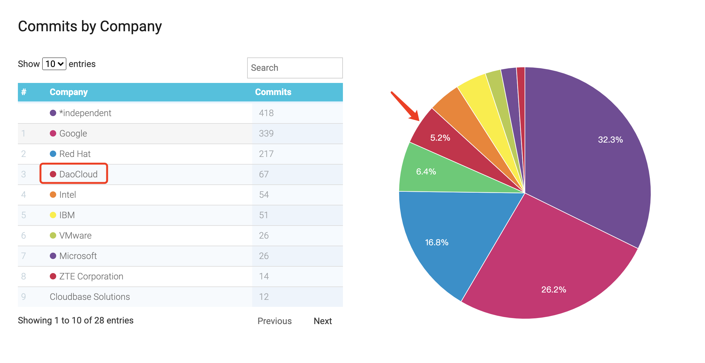

太平洋时间 2021 年 12 月 7 日，Kubernetes 1.23 正式发布。此版本更新距离上版本发布时隔 4 个月，是 2021 年的最后一个版本。受新冠疫情和国际形势变化影响以及发布团队的全球化性质，发布过程也经历了非常大的挑战。

新版本包含 47 个 enhancements「1.22 版本 53 个、1.21 版本 51 个」其中 11 个功能升级为稳定版，17 个已有功能进行优化，另有多达 19 个全新功能。

Kubernetes 1.23 版本在多个方面实现重大突破，主要围绕以下主题进行：

### 1. 重要功能

- [IPv4/IPv6 Dual-Stack Support](https://github.com/kubernetes/enhancements/issues/563)

  Kubernetes 在 v1.15 引入双栈 alpha 版本，在v1.21中双栈升级为 beta 并在 Kubernetes 集群中默认开启了对双栈的支持，在 v1.23 中双栈毕业为 GA 并删除了功能开关(Feature Gate)相关代码。集群需要满足以下要求才可以使用双栈:
  1. Node 节点要有可路由 IPv4 和 IPv6 的网络接口
  2. CNI 插件需要支持双栈
  开启双栈后，POD 的 status.IPs 字段会自动包含 IPv4 和 IPv6 地址，Service 则需要设置 spec.ipFamilyPolicy 字段为PreferDualStack 或 RequireDualStack 开启双栈，开启后，ClusterIP 类型 Service 的 clusterIPs 中会同时包含 IPv4 和 IPv6 地址。

- [Object Storage API (COSI)](https://github.com/kubernetes/enhancements/issues/1979)

  Kubernetes现在对文件和块存储都有了较好的扩展支持(CSI)，但是这些并不能很好的支持对象存储，原因如下：

  1. oss 以桶(bucket)来组织分配存储单元而不是文件系统挂载或是块设备
  2. oss 服务的访问是通过网络调用而不是本地的 POSIX 调用
  3. oss 不适用 csi 定义的 Attach/Detach 逻辑 (无需挂载/卸载)

  COSI 是关于如何为容器化的工作负载(Pod)提供对象存储服务(oss)的标准协议。与 csi 和 cni 类似，Kubernetes 旨在通过定义一些标准的接口与第三方 oss 服务提供方解耦。


- [Auto delete statefulset PVCs](https://github.com/kubernetes/enhancements/issues/1847)

  目前，由 StatefulSet 通过 volumeClaimTemplates 自动创建的 PVC 不会随着 StatefulSet 的删除而被清理。此 KEP 在StatefulSet 中添加了 `PersistentVolumeClaimRetentionPolicy` 字段，用户可以配置可以在 whenDeleted 或 whenScaled 阶段触发 Retain 或者 Delete 行为，其中 Retain 是默认行为，只有配置了 Delete 策略的 StatefulSet 再被删除时才会触发对应的 PVC 的删除。

  ```yaml
  apiVersion: apps/v1
  kind: StatefulSet
  
  spec:
    persistentVolumeClaimRetentionPolicy:
      whenDeleted: Retain
      whenScaled: Delete
  ...
  ```

- [PodSecurity Admission](https://github.com/kubernetes/enhancements/issues/2579)

  PodSecurity Admission 是 Kubernetes 在 v1.22 引入用于替代 PodSecurityPolicy 并内置于准入控制器的一个插件。在 v1.23 中，此功能已经成功升级为 beta 版本（v1beta1）并将默认开启。准入控制器的工作原理是在持久化到存储之前拦截 Kubernetes API 服务器中的请求并 `admit` 或 `deny` 一个请求。PodSecurity Admission 会使用以 `Pod Security Standard` 格式声明的配置文件对 Pod的声明进行校验，限制 Pod 对安全敏感相关字段的使用。其作用在 `namespace` 级别上，可以通过3个不同等级（privileged，baseline，restricted）和3个不同模式（enforce，audit，warn）灵活的设置限制策略，它从安全的各个维度控制 Pod 的行为，只有满足一定的条件的 Pod 才会被系统接受。

- [IngressClass Parameters GA](https://github.com/kubernetes/enhancements/issues/2365)

  不同类型的 Ingress Controller 对应的 Ingress 配置通常是不同的。当 Kubernetes 集群中存在多个 Ingress Controller 时，可能需要为 Ingress 指定指定对应的 Ingress Controller。在v1.18之前，通常是在 Ingress 资源中通过设置 `Kubernetes.io/ingress.class` 来指定使用的 Ingress Controller。在v1.18之后，可以通过 IngressClass 资源来为 Ingress 指定对应的 Ingress Controller。IngressClass 资源中包含一个可选的 `parameters` 字段，可用于为该类引用额外的、 特定于具体实现的配置。IngressClass 在v1.21新增一个特性：parameters 字段中新增 `scope` 和 `namespace` 字段，用于配置 IngressClass，这样就可以引用特定 Namespace 的资源。`scope` 默认是集群范围内的资源，将 `scope` 设置为 `namespace` 并设置 `namespace` 字段就可以使用特定 Namespace 的资源了。从v1.23开始，此特性已经毕业为 GA.

   ```bash
   apiVersion: networking.k8s.io/v1
   kind: IngressClass
   metadata:
    name: external-lb
   spec:
    controller: example.com/ingress-controller
    parameters:
      apiGroup: k8s.example.com
      kind: IngressParameters
      name: external-lb
      namespace: external-configuration
      scope: Namespace
  ```

- [Always Honor PV Reclaim Policy](https://github.com/kubernetes/enhancements/issues/2644)

  现阶段，在 PV (Persistent Volume)所配置的回收策略可能并不会被遵循。对于一个绑定的 PV-PVC (Persistent Volume Claim)对，只有 PVC 优先于 PV 被删除时才会触发回收策略。当 PV 优先 PVC 被删除时，会造成对应的存储资源没有被正常回收。此 KEP 在 PV 中引入了 `external-provisioner.volume.Kubernetes.io/finalizer` 只有当在存储系统上的物理卷删除后 PV 才会从 apiserver 中删除。

- [CSI Driver Migration](https://github.com/kubernetes/enhancements/issues/625)

  CSI(Container Storage Interface)早在v1.13版本就成功 GA 但是在 Kubernetes 的源码中仍然保留了许多存储插件(hostpath,cephfs,awsebs等)。此 KEP 旨在将 in-tree 的存储插件都以 CSI 的方式实现使得存储相关项目代码更容易被管理。
  
- [Ephemeral Containers](https://github.com/kubernetes/enhancements/issues/277)

  在生产环境中，我们有时候需要进入 Pod 的容器中去执行一些命令(e.g. netstat)帮助我们定位问题。当我们的生产容器遵循了最小镜像的最佳实践时，这行命令行工具并不会包含在我们的生产容器中。常见的解决办法是运行一个长期运行的 sideCar，在 sideCar 中内置各种调试工具并且利用 Pod 内一些 linux namespace(network等) 是共享的原理在 sideCar 执行相关命令以定位生产容器的问题。Ephemeral Containers引入了一个新的解决办法: 运行一个新的临时容器加入到 Pod 的 linux namespace 以用于排错或调试。临时容器引入了一个新的命令行参数 `debug`，与 `exec` 不同的是 exec 是在 Pod 内的容器去执行一个命令而 debug 则是将一个容器嵌入 Pod 并在其中执行命令。e.g. 
  ```bash
  $ kubectl debug -it --image=debian target-Pod -- bash
  ```

- [Add GRPC Probe](https://github.com/kubernetes/enhancements/issues/2727)
  
  v1.23中引入了 grpc 探针，在之前的版本中 k8s 支持 exec、http 和 tcp 三种方式作为容器探针。用户需要实现[GRPC Health Checking Protocol](https://github.com/grpc/grpc/blob/master/doc/health-checking.md)并且在 `LivenessProbe`、`ReadinessProbe` 或 `StartupProbe` 中使用如下配置以开启grpc探针。
  
  ```yaml
  readinessProbe:
    grpc:                     
      port: 9090              
      service: my-service     
    initialDelaySeconds: 5
    periodSeconds: 10
  ```

### 2. 其他需要了解的功能

- [Kubectl events](https://github.com/kubernetes/enhancements/issues/1440)

  新的 kubectl events 命令将提供为处理事件而量身定制的体验。除了支持 kubectl get events 命令的所有当前功能外，第一个版本还解决了 kubectl get events --watch 无法正确排序事件的问题。目前该功能还是 alpha 版本，命令为 `kubectl alpha events`。

- [Structured logging](https://github.com/kubernetes/enhancements/issues/1602)

  klog 提供了一些新的方法用于打印出结构化的日志并且所有 codebase 正在迁移使用结构化日志

  ```bash
  E1025 00:15:15.525108       1 controller_utils.go:114] "Failed to update pod status" err="timeout"
  ```

- [CRI-full Container and Pod stats](https://github.com/kubernetes/enhancements/issues/2371)

  kubelet 目前对于 containers 和 Pods 的监控信息是从 cAdvisor 获取，此 KEP 提出通过 CRI 获取相关监控信息，去除对 cAdvisor 的依赖

- [Multi-point scheduler configuration simplify](https://github.com/kubernetes/enhancements/issues/2891)

  在 `scheduler framework` 注册的 plugin 如果同时实现了多个阶段的 hook 逻辑可以在 `KubeSchedulerConfiguration` 使用 `multiPoint` 声明插件的开启

  ```yaml
  apiVersion: kubescheduler.config.k8s.io/v1beta3
  kind: KubeSchedulerConfiguration
  profiles:
    - schedulerName: multipoint-scheduler
      plugins:
        multiPoint:
          enabled:
          - name: MyPlugin
  ```

- [Identify Pod’s OS during API Server admission](https://github.com/kubernetes/enhancements/issues/2802)

  此 KEP 在 PodSpec 中添加了 `OS` 字段，因此你可以定义 Pod 应在哪个操作系统上运行。
  
### 3. Daocloud 主要参与功能 

  本次发布中，DaoCloud 重点贡献了 sig-node 和 sig-scheduling 相关内容，具体功能点如下：

- [PriorityClassValueBasedGracefulShutdown](https://github.com/kubernetes/enhancements/issues/2712)

  在 KEP `GracefulSutdown` 中，kubelet 尝试在节点关闭时优雅地终止节点中运行的 Pod 。此 KEP 允许用户配置 Pod 的优先级来控制优雅退出的时间
  ```yaml
  shutdownGracePeriodByPodPriority:
    - priority: 100000
      shutdownGracePeriodSeconds: 10
    - priority: 10000
      shutdownGracePeriodSeconds: 180
    - priority: 1000
      shutdownGracePeriodSeconds: 120
    - priority: 0
      shutdownGracePeriodSeconds: 60
  ```
  在以上的例子中，优先级为1001的 Pod 将会有120s用于退出，优先级为100001的 Pod 将会有10s用于退出。

- 优化了在 Pod 违反准入控制时的详细日志信息，帮助使用者更好的定位策略问题
- 修复了 kubelet 测试中的 npe 问题
- 重构了调度系统中 node resource plugins 的逻辑
- 升级 etcd 到3.5.1
- 结构化代码中的日志
- 修复 kubeadm 代码中用于更新 node 状态的代码逻辑
- 移除了对 SchedulingPolicy 的支持，现使用 [Scheduler Configuration](https://kubernetes.io/docs/reference/scheduling/config/)
- 移除了 NodeLabel， ServiceAffinity， NodePreferAvoidPods 插件

此外，DaoCloud 还参与了十多个问题修复，在1.23 发布过程中总计贡献 67 个提交，详情请见[贡献列表](https://www.stackalytics.io/cncf?project_type=cncf-group&release=all&metric=commits&start_date=1628006400&end_date=1638806400&module=github.com/kubernetes/kubernetes&date=118)（在该版本中有 11 位贡献者）


### 4. 版本标志


### 5. 社区贡献排名(2021.8.4 – 2021.12.7)



贡献者是 Kubernetes 的核心。从可能到可为，从理念到繁荣，科技向善不仅仅是信仰与口号，更是行动与奉献。DaoCloud 公司内部早已设有开源贡献团队，长期跟踪关注并持续为 CNCF 旗下项目社区贡献代码，推动项目的健康发展。

未来，DaoCloud 将继续与社区一同推广云原生技术，实现将最前沿的模式自由化的愿景。我们也将继续用实际行动体现自己的独特价值，为整个行业做出更多的贡献。

### 6. 注意事项

- kube-proxy 标记 `userspace` 工作模式为弃用并将在v1.25删除相关代码
- `VolumeSubpath` 的功能开关已经默认开启将在v1.25删除相关代码
- controller-manager 已经删除了对 `--port` 和 `--address` 参数的支持并且将在v1.24删除相关代码

### 7. 历史文档

- [Kubernetes 1.22，颠覆你的想象：可启用 Swap，推出 PSP 替换方案，还有……](https://mp.weixin.qq.com/s/9nH2UagDm6TkGhEyoYPgpQ)
- [Kubernetes 1.21 震撼发布 | PSP 将被废除，BareMetal 得到增强](https://mp.weixin.qq.com/s/amGjvytJatO-5a7Nz4BYPw)

### 8. 参考

1. https://docs.google.com/spreadsheets/d/1-u3kzOouB_DrQs2tCGIeCcuuqx3TyefqKF90FAD-2Q8/edit#gid=0 
2. https://en.wikipedia.org/wiki/Privilege_escalation
3. https://github.com/kubernetes/kubernetes/blob/master/CHANGELOG/CHANGELOG-1.23.md
4. https://github.com/kubernetes/sig-release/blob/master/releases/release_phases.md
5. https://github.com/kubernetes/sig-release/blob/master/releases/release-1.23/release-notes/release-notes-draft.md
6. https://cyclinder.gitbook.io/cloud-native-network/feature-gate/dual-stack 
7. http://bit.ly/k8s123-enhancements