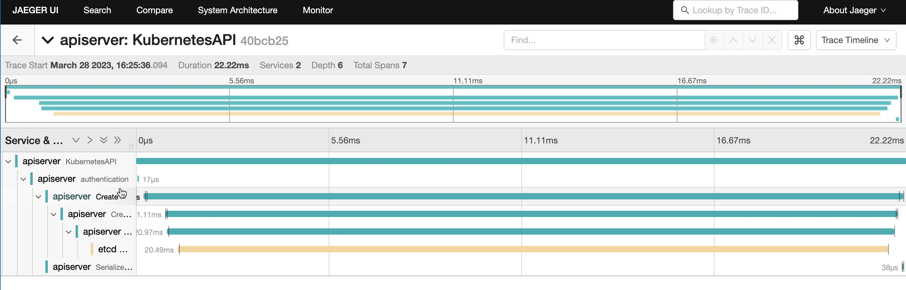

# Kubernetes 1.27 发布日志

太平洋时间 2023 年 4 月 11 日，Kubernetes 1.27 正式发布。此版本距离上版本发布时隔 4 个月，是 2023 年的第一个版本。

新版本中 release 团队跟踪了 60 个 enhancements，比之前版本都要多。其中 13 个功能升级为稳定版，29 个已有功能进行优化升级为 Beta，另有 18 个Alpha 级别的功能，大多数为全新功能。此外，还有超过 8 个功能在 GA 后被移除。

本版本包含了很多重要功能和用户体验优化，重要功能会在下一小节进行详细介绍。

## 1. 重要功能

### 镜像仓库切换 k8s.gcr.io 到 registry.gcr.io

从 Kubernetes 1.25 开始，Kubernetes 容器镜像仓库域名已经从 `k8s.gcr.io` 更改为 `registry.k8s.io`。
2023 年 3 月 20 日之后，`k8s.gcr.io` 将不在继续直接维护，而是代理到 `registry.k8s.io`。

### [Alpha] Pod 资源的纵向弹性伸缩

Kubernetes Pod 资源的原地调整大小功能，该功能不需要重建容器组，这很大程度上缓解了横向弹性的冷启动等问题。

- 在之前的版本中，Pod API 是不支持资源修改的 ，以使容器定义的资源（CPU 和内存资源类型）可变。在 1.25 中，CRI API 开始支持 Pod 资源限制的热更新。
- 为 Pod 中的容器添加了 resizePolicy 字段，以允许用户控制容器在资源变更时是否重启。
- 在容器状态中添加了 allocatedResources 字段，用于描述为 Pod 分配的节点资源。
- 在容器状态中添加了 resources 字段，用于报告应用于正在运行的容器的实际资源。
- 在 Pod 状态中添加了 resize 字段，用于描述请求调整 Pod 大小的状态。该字段可以是 Proposed（已提出），InProgress（进行中），Deferred（已延迟）或 Infeasible（不可行）。

### StatefulSet PVC 自动删除功能特性 Beta

StatefulSetAutoDeletePVC 功能在 v1.23 引入，将在 1.27 中升级为 Beta，默认开启。该功能默认开启并不表示所有的 StatefulSet 的 PVC 都会自动删除。
用户可以配置可以在 whenDeleted 或 whenScaled 阶段触发 Retain 或者 Delete 行为，其中 Retain 是默认行为，只有配置了 Delete 策略的 StatefulSet 再被删除时才会触发对应的 PVC 的删除。

### APIServer 和 Kubelet 的 Tracing 功能 Beta

APIServerTracing 升级为 Beta，默认开启，目前仅 Trace 了组件 apiserver 和 etcd，未来会添加 client-go 支持。之后其他组件会陆续添加 Tracing 能力。
apiserver 中的 tracing 仍然默认禁用，需要指定配置文件才会启用，这里需要制定 tracing 的接收端。



Kubelet 和 container runtime 通过 CRI 调用的 tracing 也已经默认开启。
<https://github.com/kubernetes/enhancements/issues/2831>

### [Beta] Kubelet 事件驱动 PLEG 升级为 Beta(但是默认关闭)

在节点 Pod 较多的情况下，通过容器运行时的 Event 驱动 Pod 状态更新，能够有效的提升效率。在 1.27中，该功能已经达到了 Beta 条件，基础的 E2E 测试任务已经添加。
之所以默认关闭该功能，是因为社区认为该功能还需要补充以下验证：压力测试、恢复测试和带退避逻辑的重试。

1. 压力测试需要在单个 pod 中创建大量容器以生成 CRI 事件，并观察 latency 值是否超过 1 秒。
2. 恢复测试则是为了验证 Kubelet 在重新启动后能否正确地更新容器状态。
3. 而带退避逻辑的重试则是为了解决 CRI Runtime 宕机时 Kubelet 可能无法连接的问题。

### 调度

#### 新功能

Mutable Pod scheduling directives when gated: 这是一个始于 Beta 版本对新功能，它和“修改悬停Job的调度指令“有一些类似，但是是为 Pod 设计的。 当我们启用该功能，如果一个 Pod 被”调度门控“拒绝，Pod 的 NodeAffinity 和 NodeSelector 可以被修改。第三方的控制器可以利用这些特性来影响调度指令。它是 Pod 调度就绪功能的一个衍生品。

#### Beta -> GA

Mutable scheduling directives for suspended Jobs: 该功能在 v1.22 以 Beta 状态引入，目前已经 GA。该功能允许修改 Pod 调度指令，如 Job 的 Pod 模版中的 NodeAffinity，NodeSelector，Toleration，schedulingGates，annotation，label。一旦开启该功能，上层的队列控制器可以在启动 Job 之前修改调度指令，达到特殊的调度目的。

#### Alpha -> Beta

Pod Scheduling Readiness: 该功能引入一个新字段至 Pod 对象，即 .spec.schedulingGates，该字段可以控制 Pod 是否允许被调度。第三方控制器可以利用该门控来满足自己的调度需求。目前 SchedulingGate 插件已经默认开启。
Respect PodTopologySpread after rolling upgrades: 它只关注 label 的键，不关注 label 的值，这样可以简化 Pod 拓扑调度的配置，同时为解决 Pod 滚动更新时调度不均衡提供了一个新的解决方案。

#### 其他

- [调度] ReadWriteOncePod feature gate 升级至 Beta 级别。
- [调度] 调度器新增 Metric “plugin_evaluation_total”。该指标显示特定插件影响调度结果的次数。
- [调度] PodSchedulingReadiness 升级至 Beta 级别。
- [调度] 调度框架 Filter 阶段利用 Skip 状态：当 Pod 调度时会进行预选流程，即我们常说的 Filter 阶段，之前所有开启的插件都会走到该流程。现在，在 PreFilter 阶段会再进行一波新的删选，如果 Pod 与该插件所关注的功能无关，将返回 Skip 状态，跳过 Filter 阶段，达到提升性能的目的。

### 存储

存储方面有以下几个功能的更新比较重要，而组快照能力更是一个重大突破。

1. NewVolumeManagerReconstruction 功能升级为 Beta版本。这是 VolumeManager 的重构，允许 kubelet 在启动期间填充关于现有卷如何挂载的附加信息。总体而言，这使得卷清理更加稳健。
2. SELinuxMountReadWriteOncePod 功能升级为 Beta 版本。该功能通过将卷正确挂载到 SELinux 标签，而不是逐个递归更改每个文件的方式加快了容器启动速度。
3. "ReadWriteOncePod" PV 访问模式功能升级为 Beta 版本。此功能引入了一个新的 ReadWriteOncePod 访问模式，用于 PersistentVolumes，限制对单个节点上的单个 pod 的访问。
4. CSINodeExpandSecret 功能升级为 Beta 级别。

#### Volume Group 快照

能够在 Pod 的所有卷上同一时间快照，将成为容灾备份和故障恢复场景的重大技术突破。现在，您不必担心应用程序因备份的卷存在几秒钟差异而无法正确运行。
此外，在安全研究方面，存储卷的组快照功能也将是一个重大变革。排查问题时，您现在可以您的快照和 Pod 的状态是可对照的。

### 上下文日志

上下文日志可以帮助用户理解日志的上下文信息，更好的让日志帮助用户排错和理解，提升日志的可观测性。
目前 kube-controller-manager 的已经完成了一部分，kube-scheduler 大部分工作将在 1.28 完成。

### kube-proxy 的 iptables 模式在大规模集群的性能优化

功能 MinimizeIPTablesRestore 在 1.26 引入，在 1.27 升级为 Beta 并默认启用，目的是改善大型集群中 kube-proxy 的 iptables 模式的性能。

如果您遇到 Service 信息未正确同步到 iptables 的问题，您可以通过把 kube-proxy 启动参数设置为 `--feature-gates=MinimizeIPTablesRestore=false` 来禁用该功能（并向社区提交问题）。你可以能通过查看 kube-proxy 的 metrics 信息中的 sync_proxy_rules_iptables_partial_restore_failures_total 指标来监控到规则同步失败的次数。

### CRD validation expression language

CustomResourceValidationExpressions 在 v1.25 中就已经升级为 Beta。验证规则使用通用表达式语言（CEL）来验证定制资源的值。
验证规则使用 x-kubernetes-validations 扩展包含在 CustomResourceDefinition 模式定义中。
在 v1.27 中，ValidationRule 新增了字段 messageExpression，可以更好的展示提示信息。在之前版本中，只支持固定的失败信息。

```yaml
x-kubernetes-validations:
- rule: "self.x <= self.maxLimit"
  messageExpression: '"x exceeded max limit of " + string(self.maxLimit)'
```

## 2. 其他需要了解的功能

- [apps] PodDisruptionBudget 之前不支持指定不健康 Pod 的处理方法，不健康 Pod 是指 Pod Running 但是状态不是 Ready。 我们添加了一个新字段 unhealthyPodEvictionPolicy，允许用户指定这些不健康的pod应该发生什么。该字段在 v1.27 中升级为 Beta。
- [apps] "StatefulSetStartOrdinal" 功能升级为 Beta，默认允许在 StatefulSet 中配置起始序号。
- [apps] Cronjob 支持 Timezone 功能 GA。
- [apps] Enable the "StatefulSetStartOrdinal" feature gate in Beta.
- [apps] DownwardAPIHugePages kubelet 功能已稳定 GA。
- [apps] Indexed JOb 的 API 验证已放宽，允许通过同时更改 parallelism 和 completions 来扩展或者缩小 Indexed Job，但是需要保持 parallelism == completions 同步修改。
- [API] 基于 Kubernetes v1.25 提供的 KEP-2876 CRD验证表达式语言，该功能增加一个新的资源 —— `ValidatingAdmissionPolicy`，允许在不使用 Validation Webhook 时实现字段验证。在 1.27 中，
- [API] Kubernetes 为聚合发现提供了 Beta 支持，通过 `/api` 和 `/apis` 发布集群支持的所有资源，而不是每个 Group 分别提供。
- [API] OpenAPIV3 功能 GA, 允许 API 服务器发布 OpenAPI V3。社区建议使用 OpenAPI v3，v3 有诸多优势，其中包括 CustomResourceDefinition OpenAPI v3 验证模式的无损表示，而 OpenAPI v2 在 CRD validation 中做了有损转换。
- [API] 将 SelfSubjectReview 提升为 Beta 级别。
- [auth] KMSv2 升级为 Beta，该功能在 1.27 中做了许多优化，比如：在插件 key ID 不变的情况下，重用 DEK 数据加密密钥，而当 Server 启动时，DEK 会重新随机生成。
- [auth] 添加了一个新的 Alpha API：ClusterTrustBundle（certificates.k8s.io/v1Alpha1）。
- [auth] AdmissionWebhookMatchConditions 功能门已进入 Alpha： 在v1Beta和v1 API中，为`ValidatingWebhookConfiguration`和`MutatingWebhookConfiguration`添加了 `MatchConditions` 字段。
- [auth] 将 LegacyServiceAccountTokenTracking 功能门升级为Beta，用于跟踪基于 Sercet 的 SA token 的使用情况。
- [CLI] kubectl 的 `--subresource` 支持升级为 Beta，目前 subresource 只支持 status 和 scale。
- [网络] 当外部 cloud provider 支持提供双战 IP 时，在 kubelet 中启用 `CloudNodeIPs` 功能，您就可以指定双栈的 `--node-ip`。该功能目前是 Alpha，需要手动开启。
ValidatingAdmissionPolicy 添加了 matchConditions 字段，用来支持基于 CEL 的自定义匹配条件。该功能目前仍然是 Alpha 。
- [网络] 允许动态扩展可用于服务 Service 的 IP 数量。新增了 MultiCIDRServiceAllocator 功能，目前是 Alpha 级别。
- [网络] 新功能门限 ServiceNodePortStaticSubrange，以启用新的策略在 NodePort 服务端口分配器中，因此节点端口范围被细分，并且首选从上部分配动态分配的 NodePort 端口为服务。
- [网络] 添加了有关工作负载资源（Pod、ReplicaSets、Deployments、Jobs、CronJobs或ReplicationControllers）名称无效DNS标签的警告。
- [弹性] HPAContainerMetrics 升级为 Beta，该功能允许 HorizontalPodAutoscaler 基于目标 Pods 中各容器 ContainerResource 类型的 metrics 来执行扩缩操作。
- [节点] 动态资源分配功能，使用功能门 DynamicResourceAllocation。新增的 API 比 Kubernetes 现有的设备插件 Device Plugin 功能更加灵活。因为它允许 Pod 请求（声明）指定类型的资源，这些资源可以在节点级别、集群级别或任何其他用户自定义实现的模型中使用。
- [节点] 用户命名空间支持范围扩大，该功能仍然是 Alpha，但相比 v1.26 支持 StatefulSet。
- [节点] GRPC 探针功能 GA。
- [节点] Bump default API QPS limits for Kubelet.
- [节点] Graduate Kubelet Topology Manager to GA.
- [节点] 提高 Kubelet 的默认 API QPS 限制，其中 kubeAPIQPS 和 kubeAPIBurst 都调大了 10 倍。
- [节点] Kubelet 的拓扑管理器 Topology Manager 功能 GA。
- [节点] seccomp profile 默认值升级至 GA 级别。
- [日志] 添加了 NodeLogQuery 功能门，为集群管理员提供了使用 kubectl 流式查看日志的功能，无需实现客户端读取器或登录节点。对 Windows 的支持也在逐步完善。
- [日志] kube-proxy、kube-scheduler 和 kubelet 有 HTTP API，可以在运行时更改日志 Level。该功能也适用于 JSON 格式日志输出。
- [metrics] /metrics/slis 现在可用于控制平面组件，可以用来获取当前组件的健康检查指标。
- [Lease] Kubernetes 组件选举现在仅支持使用 Lease。

## 3. DaoCloud 参与功能

本次发布中， DaoCloud 重点贡献了 sig-node，sig-scheduling 和 kubeadm 相关内容，具体功能点如下：

- [client-go] 修复尝试获取 leader lease 的等待时间的问题。
- [node] 如果 Pod 的 spec.terminationGracePeriodSeconds 属性值是负数，则会被视为设定了1秒的 terminationGracePeriodSeconds。
- [node] 添加了一个可以限制节点进行并行镜像下载数量的新功能。
- [node] 改进目前 Memory QoS 功能，优化了其在 cgroup v2 场景的适配性。
- [scheduling] MinDomainsInPodTopologySpread 功能升级为 Beta。
- [scheduling] 当任何调度程序插件在 PostFilter 中返回 unschedulableAndUnresolvable 状态时，该 Pod 的调度周期立即终止。
- [instrumentation] 迁移控制器使用 contextual logging。
- [node] Kubelet：将“--container-runtime-endpoint”和“--image-service-endpoint”迁移到kubelet配置中。
- [kubeadm] Kubeadm: 添加特性门控 EtcdLearnerMode，它允许将新增的控制节点的 etcd 作为学习者 Learner 加入，然后再升级为投票成员。
- [node] Kubelet 默认允许 Pod 使用 net.ipv4.ip_local_reserved_ports sysctl，要求内核版本 3.16+。

在 v1.27 发布过程中，DaoCloud 参与上百个问题修复和功能研发，作为作者约有 90 个提交，详情请见[贡献列表](https://www.stackalytics.io/cncf?project_type=cncf-group&release=all&metric=commits&module=github.com/kubernetes/kubernetes&date=118)（该版本的两百多位贡献者中有来自 DaoCloud 的 15 位）。在 Kubernetes v1.27 的发布周期中，DaoCloud 的多名研发工程师取得了不少成就。其中，由张世明主要维护的项目 KWOK (Kubernetes Without Kubelet) 成为社区热点，并在大规模集群模拟方面有效地节约资源，提升效率。几位研发人员参与了 Kubernetes 官网的大量中文翻译工作，其中要海峰几乎包揽了近期官网博客的翻译，并成为 SIG-doc-zh 的维护者。此外，刘梦姣也是 SIG-doc 的维护者。在即将召开的 2023 年欧洲 KubeCon 上，殷纳将以调度方向的维护者身份作为讲师，分享调度方向的深度剖析；徐俊杰将分享 kubeadm 的深度解析。

## 4. 版本标志

本次发布的主题是 。 Kubernetes 是。


## 5. 升级注意事项

本节主要介绍 v1.27 中 API 变化，以及功能的移除以及废弃，废弃的功能通常会在 1-2 个版本之后移除。更多详情请查看[Kubernetes 在 v1.27 中移除的特性和主要变更](https://kubernetes.io/zh-cn/blog/2023/03/17/upcoming-changes-in-kubernetes-v1-27/)

其中需要重点关注的，IPv6DualStack 外部云供应商特性门控已被删除。（该功能在1.23版本中成为GA，几个版本之前已删除所有其他组件的特性门控。）如果您仍然手动启用它，则必须立即停止。

### k8s.gcr.io 重定向到 registry.k8s.io 相关说明

Kubernetes 项目为了托管其容器镜像，使用社区拥有的一个名为 registry.k8s.io. 的镜像仓库。 从 3 月 20 日起，所有来自过期 k8s.gcr.io 仓库的流量将被重定向到 registry.k8s.io。 已弃用的 k8s.gcr.io 仓库最终将被淘汰。

### 其他需要注意的变化

- CSIStorageCapacity 的 storage.k8s.io/v1Beta1 API 版本在 v1.24 中已被弃用，将在 v1.27 中被移除。
- 移除 NetworkPolicyEndPort、LocalStorageCapacityIsolation、StatefulSetMinReadySeconds、IdentifyPodOS、DaemonSetUpdateSurge、EphemeralContainers、CSIInlineVolume、CSIMigration、ControllerManagerLeaderMigration 特性门控，这些特性大部分都是在 v1.25 之前的版本正式 GA。
- kube-apiserver 移除了 --master-service-namespace 命令行参数
- kube-controller-manager 命令行参数 --enable-taint-manager 和 --pod-eviction-timeout 被移除。
- kubelet 移除了命令行参数 --container-runtime，该参数目前只有一个可选值 "remote" 并在之前版本中废弃。
- 弃用了 Alpha 状态的 seccomp 注解 seccomp.security.Alpha.kubernetes.io/pod 和 container.seccomp.security.Alpha.kubernetes.io。
- SecurityContextDeny 特性门控已经废弃，将在未来版本移除。
- Linux/arm will not ship in Kubernetes 1.27 as we are running into issues with building artifacts using golang 1.20.2

## 6. 历史文档

- [Kubernetes 正式发布 v1.26，稳定性显著提升](https://mp.weixin.qq.com/s/qwzmeIM4INz-_BK_gbwOxw)
- [Kubernetes 1.25 正式发布，多方面重大突破](https://mp.weixin.qq.com/s/aRmLBYpk0MhLJAwY85DyuA)
- [Kubernetes 1.24 走向成熟的 Kubernetes](https://mp.weixin.qq.com/s/vqH8ueaZeEeZbx_axNVSjg)
- [Kubernetes 1.23 正式发布，有哪些增强？](https://mp.weixin.qq.com/s/A5GBv5Yn6tQK_r6_FSyp9A)
- [Kubernetes 1.22 颠覆你的想象：可启用 Swap，推出 PSP 替换方案，还有……](https://mp.weixin.qq.com/s/9nH2UagDm6TkGhEyoYPgpQ)
- [Kubernetes 1.21 震撼发布 | PSP 将被废除，BareMetal 得到增强](https://mp.weixin.qq.com/s/amGjvytJatO-5a7Nz4BYPw)

## 7. 参考

1. 官方 Changelog <https://github.com/kubernetes/kubernetes/blob/master/CHANGELOG/CHANGELOG-1.27.md>
2. Blog <https://kubernetes.io/zh-cn/blog/2023/03/17/upcoming-changes-in-kubernetes-v1-27/>
3. Kwok 官网 https://github.com/kubernetes-sigs/kwok/
4. v1.27 Release 团队看板 <https://github.com/orgs/kubernetes/projects/117/views/1>
