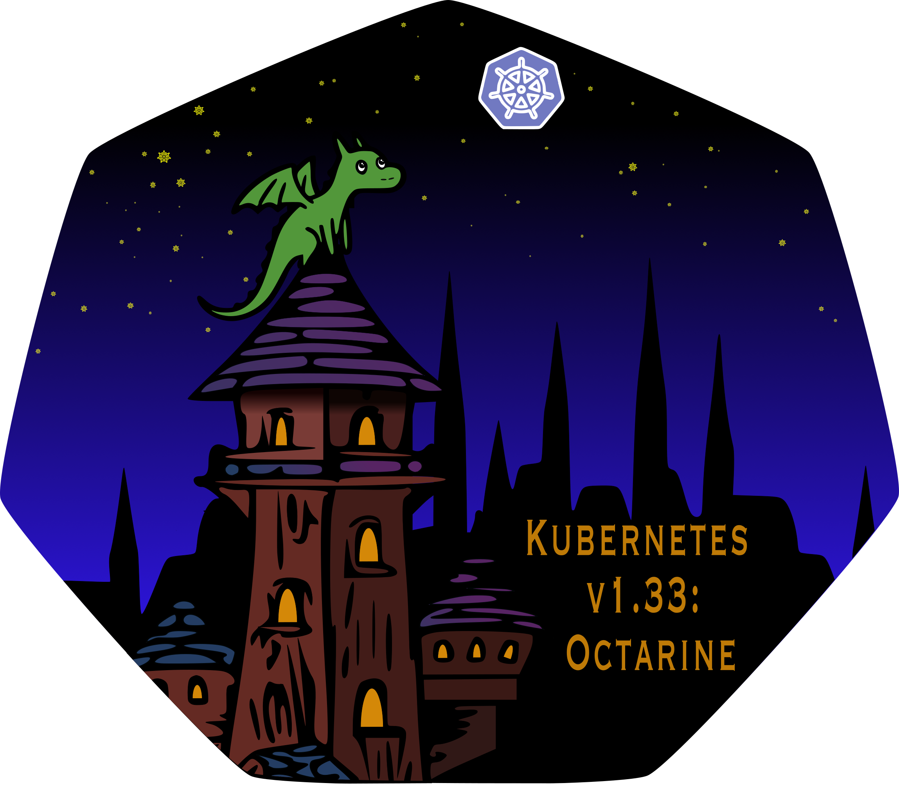

# 重磅！K8s正式支持Sidecar容器，v1.33版本这些改动将影响你的集群

太平洋时间 2025 年 4 月 23 日，主题为 Octarine 的 Kubernetes v1.33 正式发布。

此版本距离上版本发布时隔 4 个月，是 2025 年的第一个版本。

与之前的版本类似，Kubernetes v1.33 版本引入了多项新的稳定、Beta 和 Alpha 版本的功能。一贯交付高质量版本的承诺凸显了 Kubernetes 社区的开发周期实力和社区的活跃支持。

此版本包含 64 项改进。在这些改进功能中，有 18 项已晋升为稳定版，另外有 20 项正在进入 Beta 阶段，以及最后的 24 项为 Alpha 阶段。

## 发布主题和 Logo

Kubernetes v1.33 的发布主题是 Octarine：它描述地是特里·普拉切特（Terry Pratchett）在《碟形世界》系列中创造的虚构颜色，被称为“魔法之色”或“第八种颜色”。这一版本突出了 Kubernetes 在整个生态系统中所激发的开源魔法。熟悉碟形世界的读者或许能辨认出，在无形大学的塔楼顶端栖息着一只小沼泽龙，它正凝视着安克-莫波克城市上空闪烁着 64 颗星辰的 Kubernetes 月亮。

在 Kubernetes 迈入第二个十年之际，我们既要赞颂维护者们的魔法造诣，也要欣赏新贡献者的探索精神，更要颂扬推动项目发展的协作文化。正如普拉切特所言："即使你知晓魔法的原理，它依然充满魔力"。v1.33 版本的发布再次印证了这一点 -- 即便你熟稔 Kubernetes 代码库的每个细节，当版本周期尘埃落定时，回望整个过程仍能感受到那份神奇的魔法力量。

Kubernetes v1.33 印证了开源创新的持久魅力。来自全球的数百位贡献者通力协作，共同缔造了这个非凡的作品。每个新功能背后，都凝聚着社区成员维护和改进项目的心血，确保系统安全可靠并如期发布。每个版本都承前启后，最终汇聚成超越个人成就的集体智慧结晶。

## GA 和稳定的功能

GA 全称 General Availability，即正式发布。Kubernetes 的进阶路线通常是 Alpha、Beta、Stable (即 GA)、Deprecation/Removal 这四个阶段。下文择取了部分特性详述。如果对其他特性感兴趣，请移步至具体的 KEP 页面了解进展和详情。

### KEP-753 原生支持 Sidecar 容器

它为 init 容器引入了 restartPolicy 字段，并使用这个字段来指示 init 容器是 Sidecar 容器。 kubelet 将按照 restartPolicy=Always 的顺序与其他 init 容器一起启动 init 容器，但它不会等待其完成，而是等待容器启动完成。

启动完成的条件是启动探针成功（或者未定义启动探针）并且 postStart 处理程序完成。此条件用 ContainerStatus 类型的字段 Started 表示。 有关选择此信号的注意事项，请参阅 “Pod 启动完成条件” 部分。

字段 restartPolicy 仅在 init 容器上被接受。现在唯一支持的值是 “Always”。不会定义其他值。此外，该字段可为空，因此默认值为“空”。容器的 restartPolicy 的其他值将不被接受，容器将遵循当前实现的逻辑。

Sidecar 容器不会阻止 Pod 完成 - 如果所有常规容器都已完成，Sidecar 容器将被终止。 在 Sidecar 启动阶段，重启行为将类似于 init 容器。如果 Pod restartPolicy 为 Never，则启动期间失败的 Sidecar 容器将不会重新启动，整个 Pod 将失败。如果 Pod restartPolicy 为 Always 或 OnFailure，则会重新启动。一旦 Sidecar 容器启动（postStart 完成且启动探针成功），即使 Pod restartPolicy 为 Never 或 OnFailure，这些容器也会重新启动。此外，即使在 Pod 终止期间，Sidecar 容器也会重新启动。

为了最大限度地减少 Sidecar 容器的 OOM 杀死，这些容器的 OOM 调整将匹配或超过 Pod 中常规容器的 OOM 分数调整。 

其他 init 容器不同，Sidecar 容器还支持以下配置：

- Sidecar 容器的 PostStart 和 PreStop 生命周期处理程序
- 所有探针（启动、就绪、活跃）

Sidecar 的就绪探针将有助于确定整个 Pod 的就绪情况。

### KEP-2644 始终遵循 PersistentVolume 回收策略

此增强功能解决了持久卷 （PV） 回收策略未始终遵守，从而导致潜在存储资源泄漏的问题。具体而言，如果 PV 在其关联的持久性卷声明 （PVC） 之前被删除，则可能无法执行“删除”回收策略，从而保持底层存储资产不变。为了缓解这种情况，Kubernetes 现在在相关 PV 上设置终结器，确保无论删除顺序如何，都会执行回收策略。此增强功能可防止意外保留存储资源，并保持 PV 生命周期管理的一致性。

### KEP-3866 Kube-proxy 基于 nftables 的实现

kube-proxy 的 nftables 后端现在是稳定的，增加了一个新的实现，显著提高了 Kubernetes 集群中服务实现的性能和可扩展性。出于兼容性原因，iptables 在 Linux 节点上仍然是默认值。如果您想尝试一下，请查看[Kubernetes 官方的迁移指南](https://kubernetes.io/docs/reference/networking/virtual-ips/#migrating-from-iptables-mode-to-nftables)。

### 更新总览

- [KEP-753 原生支持 Sidecar 容器](https://kep.k8s.io/753)
- [KEP-1495 允许使用任何自定义的资源来做作为 PVC 中的 DataSource](https://kep.k8s.io/1495)
- [KEP-1880 管理 Kubernetes Service 的 IP 范围 (因依赖 Beta API，默认关闭)](https://kep.k8s.io/1880)
- [KEP-2433 EndpointSlice 控制器可以配置为提供拓扑感知提示，从而实现简单的拓扑感知路由](https://kep.k8s.io/2433)
- [KEP-2589 Portworx 卷/持久卷支持 CSI 迁移](https://kep.k8s.io/2589)
- [KEP-2590 kubectl 增加对子资源的支持](https://kep.k8s.io/2590)
- [KEP-2625 CPU 管理器扩展可拒绝不符合 SMT 的工作负载，以使对延迟敏感的应用程序在启用 SMT 的系统上运行时的行为更加可预测](https://kep.k8s.io/2625)
- [KEP-2644 始终遵守 PersistentVolume 回收策略，防止 PersistentVolume 删除后，存储系统中的数据卷依然存在的情况](https://kep.k8s.io/2644)
- [KEP-3094 计算 PodTopologySpread 偏差时考虑污点/容忍度](https://kep.k8s.io/3094)
- [KEP-3633 将 MatchLabelKeys 和 MismatchLabelKeys 引入 PodAffinity 和 PodAntiAffinity，能够在现有 LabelSelector 之上精细控制 Pod 预期共存 (PodAffinity) 或不共存 (PodAntiAffinity) 的范围](https://kep.k8s.io/3633)
- [KEP-3850 扩展了 Job API 以支持索引作业，其中退避限制是每个索引，并且尽管某些索引失败，作业仍可继续执行](https://kep.k8s.io/3850)
- [KEP-3857 递归的只读挂载](https://kep.k8s.io/3857)
- [KEP-3866 Kube-proxy 基于 nftables（Linux Kernel 社区对 iptables 的替代）实现了新的后端，旨在解决 iptables 现存的性能问题](https://kep.k8s.io/3866)
- [KEP-3998 Job 添加自定义的 Job 成功策略的支持，一旦 Job 满足成功策略，其余的 Pod 将被终止](https://kep.k8s.io/3998)
- [KEP-4004 弃用 v1.Node 的 `status.nodeInfo.kubeProxyVersion` 字段](https://kep.k8s.io/4004)
- [KEP-4008 允许特殊的 CRD 校验失败，如果出现了在未经修改的字段上发生的校验失败，即便是校验不通过，也允许对 CRD 资源的更新，并会将修改应用到资源上](https://kep.k8s.io/4008)
- [KEP-4193 改进绑定的服务帐户令牌，自动将 Pod 关联的节点的 name 和 uid （通过 spec.nodeName ）嵌入到生成的令牌中，并允许用户获取专门与 Node 对象生命周期相关的令牌](https://kep.k8s.io/4193)
- [KEP-4444 服务流量分配，在 Service 中实现了一个新字段，作为底层实现在制定路由决策时要考虑的偏好或提示](https://kep.k8s.io/4444)

## 进入 Beta 阶段的功能

Beta 阶段的功能是指那些已经经过 Alpha 阶段的功能，且在 Beta 阶段中添加了更多的测试和验证，通常情况下是默认启用的。下文择取了部分特性详述。如果对其他特性感兴趣，请移步至具体的 KEP 页面了解进展和详情。

### KEP-1287 就地调整资源大小以垂直扩展 Pod

在 KEP 之前，PodSpec 中定义的容器资源是不可变的，在 Pod 中更新这些容器资源中的任何一个都会触发 Pod 替换。现在 PodSpec 可变，以便可以就地更新 Pod 资源请求和限制，而无需重启 Pod 或其容器。此 KEP 改进了容器运行时接口 (CRI) API，用于在运行时管理容器的内存和 CPU 资源配置。这对于有状态和批处理工作负载非常有用，因为 Pod 重启可能会造成严重的中断。

### 更新总览

- [KEP-127 支持用户命名空间，进程能够在具有与主机不同的用户和组 ID 的 pod 中运行。](https://kep.k8s.io/127)
- [KEP-1287 支持了 Pod 资源原地升级（In-Place Update）功能，允许在不重新创建 Pod 或重新启动容器的情况下更改资源](https://kep.k8s.io/1287)
- [KEP-1710 通过使用正确的 SELinux 标签挂载卷而不是递归更改卷上的每个文件来加速容器启动](https://kep.k8s.io/1710)
- [KEP-2862 为 Node 资源新增若干子资源类型，为 kubelet 提供更细粒度的 API 接口鉴权](https://kep.k8s.io/2862)
- [KEP-2902 添加 CPUManager 策略选项，以跨 NUMA 节点分配 CPU，而不是打包它们](https://kep.k8s.io/2902)
- [KEP-3257 提供一种包含 X.509 信任锚的 Kubernetes 数据类型，以便在需要一组 X.509 信任锚的任何地方使用](https://kep.k8s.io/3257)
- [KEP-3619 细粒度的补充组控制](https://kep.k8s.io/3619)
- [KEP-4265 允许用户选择退出 Linux 容器的 CRI 屏蔽 /proc (因依赖默认关闭的 Beta 功能 UserNamespacesSupport，导致默认关闭)](https://kep.k8s.io/4265)
- [KEP-4355 提供了一种“协调的”组件领导者选举机制，对于升级和回滚来说更安全。](https://kep.k8s.io/4355)
- [KEP-4381 借助结构化参数，kube-scheduler 和 Cluster Autoscaler 可以自行处理和模拟声明分配，而无需依赖第三方驱动程序](https://kep.k8s.io/4381)
- [KEP-4427 dnsConfig.searches 支持对 DNS 搜索字符串进行宽松验证，允许包含 “.” 和 “_” 字符](https://kep.k8s.io/4427)
- [KEP-4540 引入了新的 CPUManager 策略选项 strict-cpu-reservation，确保 reservedSystemCPUs 严格保留用于系统守护程序或中断处理，并且不会被 QoS 类为 Burstable 和 BestEffort 的 Pod 使用](https://kep.k8s.io/4540)
- [KEP-4639 新增基于 OCI 镜像的只读卷](https://kep.k8s.io/4639)
- [KEP-4817 在 ResourceClaim.Status 中添加驱动程序拥有的字段以及可能的标准化网络接口数据](https://kep.k8s.io/4817)
- [KEP-4818 PreStop Hook 的睡眠操作允许零值](https://kep.k8s.io/4818)
- [KEP-4832 提高调度吞吐量，当 Pod 需要通过异步 API 调用发出抢占时](https://kep.k8s.io/4832)
- [KEP-5073 使用 validation-gen 生成验证代码，实现 Kubernetes 原生类型的声明式验证。](https://kep.k8s.io/5073)
- [KEP-5080 根据逻辑依赖关系和安全考虑，引入命名空间删除的删除优先级，优先删除某些资源类型。该特性被移植到 1.30 - 1.32 版本](https://kep.k8s.io/5080)
- [KEP-5100 在 Windows kube-proxy 中支持 DSR 和 Overlay 网络](https://kep.k8s.io/5100)
- [KEP-5116 Kubernetes API 服务器提供的集合（列表响应）实现流式编码，流式编码过程可以显著减少内存使用量，从而提高可扩展性和成本效益](https://kep.k8s.io/5116)
- [KEP-5142 当调度器中的 activeQ 为空时，允许从 backoffQ 弹出 Pod](https://kep.k8s.io/5142)

## 进入 Alpha 阶段的功能

Alpha 阶段的功能是指那些刚刚被引入的功能，这些功能是默认关闭的，需要用户手动开启。

- [KEP-740  提供服务帐户令牌与外部签名进行集成方法，易于更新令牌和提供安全性](https://kep.k8s.io/740)
- [KEP-2535 允许用户确保 kubelet 需要对每组新凭证进行镜像拉取身份验证检查，无论节点上是否已存在该镜像](https://kep.k8s.io/2535)
- [KEP-3015 添加一种方法来向 kube-proxy 发出信号，表明它应该尽可能将流量传输到本地端点，以提高效率](https://kep.k8s.io/3015)
- [KEP-3104 实现 .kuberc 文件，将用户偏好设置与集群配置分开](https://kep.k8s.io/3104)
- [KEP-3314 向 CSI 添加差异快照，以提供一种通用方法，用于获取由后端存储中的块存储卷支持的 PersistentVolume 的两个任意 CSI VolumeSnapshots 的差异快照](https://kep.k8s.io/3314)
- [KEP-3973 Deployment 在处理终止 Pod 的方式上具有不一致的行为，具体取决于推出策略和扩展 Deployment 的时间。在某些情况下，等待终止的 Pod 终止后再启动新的 Pod 可能是有利的。在其他情况下，尽快旋转它们可能是有益的。此 KEP 为 Deployment添加了新字段 .spec.podReplacementPolicy，以允许用户指定所需的行为](https://kep.k8s.io/3973)
- [KEP-4049 当需要动态提供 PV 资源时，调度器中的 VolumeBinding 插件将根据节点的存储容量，对节点进行打分](https://kep.k8s.io/4049)
- [KEP-4205 集成 PSI 指标，并使用这些指标设置节点条件，用于防止在遇到严重资源限制的节点上调度 Pod](https://kep.k8s.io/4205)
- [KEP-4412 允许通过绑定到工作负载的服务账户，生成用于授权镜像拉取的令牌，避免需要长期存在的持久密钥](https://kep.k8s.io/4412)
- [KEP-4603 改进 Pod 重启退避逻辑，以更好地匹配它创建的实际负载并满足新兴用例，同时为集群作员提供一个选项，以便为特定节点上的所有容器配置更低的最大回退，最低可至 1 秒](https://kep.k8s.io/)
- [KEP-4742 允许在 Pod 中通过 downward API 中使用节点标签](https://kep.k8s.io/4742)
- [KEP-4815 向 DRA 添加对可分区设备的支持](https://kep.k8s.io/4815)
- [KEP-4816 允许工作负载通过 ResourceClaim 指定可配合使用的替代设备类型，而无需用户修改编排清单](https://kep.k8s.io/4816)
- [KEP-4858 相关资源对象更新了 IP/CIDR 有效性标准，以避免不明确可解析的 IP/CIDR 带来潜在的安全问题](https://kep.k8s.io/4858)
- [KEP-4876 允许 CSI 驱动程序可以在运行时动态调整可附加卷的最大数量](https://kep.k8s.io/4876)
- [KEP-4951 HorizontalPodAutoscaler 新增 tolerance 字段来指定允许的指标偏差，当使用比率约为 1 时，使用自定义值可精细地触发扩容操作](https://kep.k8s.io/4951)
- [KEP-4960 新增支持为容器配置自定义停止信号来替代 kubelet 发送的默认信号 SIGTERM，为特定工作负载实现优雅推出，如发送 SIGUSR1 信号给 Nginx 容器](https://kep.k8s.io/4960)
- [KEP-4988 改进 apiserver watch cache 以提供分页](https://kep.k8s.io/4988)
- [KEP-5018 允许在特权模式下创建 ResourceClaims 和 ResourceClaimTemplates，以授予对其他用户正在使用的设备的访问权限，以执行管理任务，例如监控设备的运行状况或状态](https://kep.k8s.io/5018)
- [KEP-5055 支持将设备标记为受污染可以防止将其用于新 Pod 和/或导致使用它们的 Pod 停止](https://kep.k8s.io/5055)
- [KEP-5067 利用现有的元数据 Generation 字段，并在 Pod 状态中添加一个新的 status.observedGeneration 字段，允许 Pod 状态字段表示当前哪些 Pod 更新反映在 Pod 状态中](https://kep.k8s.io/)
- [KEP-5109 引入一个新的 CPU 管理器静态策略选项，该选项尽最大努力通过 L3（最后一级）缓存来调整 CPU 资源](https://kep.k8s.io/5109)

## 删除和废弃功能

### GitRepo 类型的卷

开始默认弃用过程，将在未来版本完全删除其树内实现，仅保留对象类型

### 弃用稳定的 Endpoints API

EndpointSlices API 自 v1.21 起已稳定，实际上取代了原有的 Endpoints API。虽然原有的 Endpoints API 简单直接， 但在扩展到大量网络端点时也带来了一些挑战。EndpointSlices API 引入了诸如双栈网络等新特性， 使得原有的 Endpoints API 已准备好被弃用。 此弃用仅影响那些直接在工作负载或脚本中使用 Endpoints API 的用户；这些用户应迁移到使用 EndpointSlices。

### 节点状态中 kube-proxy 版本信息的移除

此字段由 kubelet 设置，但其值并不总是准确的。由于自 v1.31 起该字段默认已被禁用，v1.33 发行版完全移除此字段。

## 移除对 Windows Pod 的主机网络支持

Windows Pod 网络旨在通过允许容器使用节点的网络命名空间来实现与 Linux 的特性对等，并提供更高的集群密度。最初的实现作为 Alpha 版本在 v1.26 中引入，但由于遇到了未预期的 containerd 行为，且存在替代方案，Kubernetes 项目决定撤回相关的 KEP。并在 v1.33 中完全移除对该特性的支持。

## DaoCloud 社区贡献

在 v1.33 发布过程中，DaoCloud 参与多个问题修复和功能研发，有60余次提交，位居前三，详情请见[贡献列表](https://www.stackalytics.io/cncf?project_type=cncf-group&release=all&metric=commits&module=github.com/kubernetes/kubernetes&date=120)。

同时该发布周期中，DaoCloud 的多名研发工程师取得了不少成就。其中：

- [蔡威（Iceber）](https://github.com/Iceber) 解锁 Kubestronaut 称号
- [范宝发（carlory）](https://github.com/carlory)成为 kubeadm 和 [CSI 子项目](https://github.com/kubernetes-csi/csi-driver-host-path) 的 Approver；
- [颜开（yankay）](https://github.com/yankay)成为了 Kubernetes 子项目 [LeaderWorkerSet](https://github.com/kubernetes-sigs/lws) 的项目 Reviewer。

> [LeaderWorkerSet](https://github.com/kubernetes-sigs/lws) 项目是关于通过引入新的 LeaderWorkerSet 资源允许管理和水平伸缩跨节点的 Stateful（有状态工作负载）的项目。在 AI 热门的当下，使用 LeaderWorkerSet 可以方便地管理和调度诸如 LLM 和大型 AI 模型时所需的模型并行和数据并行的工作负载。

## 发行说明

上述内容就是 Kubernetes v1.33 的主要更新和内容啦，更多的发布说明可以查看 Kubernetes v1.33 版本的完整详细信息：`https://github.com/kubernetes/kubernetes/blob/master/CHANGELOG/CHANGELOG-1.33.md`。

我们下次版本发布时再见！

## 历史文档

- [Kubernetes 1.32 还在写 Webhook? 你已经 OUT 了！](https://mp.weixin.qq.com/s?__biz=MzI5ODQ2MzI3NQ==&mid=2247513735&idx=1&sn=e5f844df272b5bb691382fb5f324cbbd&chksm=ed0baa783029653a0e13882cd76ef2dc29eb75ada3a7d213c07a3bff3829abd230cad5d8f340&scene=126&sessionid=1734429261#rd)
- [Kubernetes 1.31 发布！十年 OCI 镜像借着 AI 的风终于加入 Volume 的大家庭 ~](https://mp.weixin.qq.com/s/bl5ozc90PhWMO3l-deiJbw)
- [最可爱的版本 UwU - Kubernetes v1.30 发布！](https://mp.weixin.qq.com/s?__biz=MzA5NTUxNzE4MQ==&mid=2659286459&idx=1&sn=bcb8d232b7b611caf89b7dbf17ce0299&chksm=8bcbfd29bcbc743f88806920a1f5200450deac6575db3d20371f76c54d33140d5f4ce39f19f7)
- [Kubernetes 1.29 全新特性： 抛弃 iptables 还在等什么...](https://mp.weixin.qq.com/s/ZZJBRWauVo-VwNFHkNQ_2w)
- [Kubernetes 1.28 震撼发布，Sidecar Containers 迎面而来](https://mp.weixin.qq.com/s/Dr_JpSD9tzfahslZO2bX5A)
- [近两年功能增加最多！Kubernetes 1.27 正式发布](https://mp.weixin.qq.com/s/maDEiCGzOPSDkH9dUxIxdA)
- [Kubernetes 正式发布 v1.26，稳定性显著提升](https://mp.weixin.qq.com/s/qwzmeIM4INz-_BK_gbwOxw)
- [Kubernetes 1.25 正式发布，多方面重大突破](https://mp.weixin.qq.com/s/aRmLBYpk0MhLJAwY85DyuA)
- [Kubernetes 1.24 走向成熟的 Kubernetes](https://mp.weixin.qq.com/s/vqH8ueaZeEeZbx_axNVSjg)
- [Kubernetes 1.23 正式发布，有哪些增强？](https://mp.weixin.qq.com/s/A5GBv5Yn6tQK_r6_FSyp9A)
- [Kubernetes 1.22 颠覆你的想象：可启用 Swap，推出 PSP 替换方案，还有……](https://mp.weixin.qq.com/s/9nH2UagDm6TkGhEyoYPgpQ)
- [Kubernetes 1.21 震撼发布 | PSP 将被废除，BareMetal 得到增强](https://mp.weixin.qq.com/s/amGjvytJatO-5a7Nz4BYPw)

## 参考

1. Kubernetes 增强特性 <https://kep.k8s.io/>
2. Kubernetes 1.33 发布团队 <https://github.com/kubernetes/sig-release/blob/master/releases/release-1.33>
3. Kubernetes 1.33 变更日志 <https://github.com/kubernetes/kubernetes/blob/master/CHANGELOG/CHANGELOG-1.33.md>
4. Kubernetes 1.33 主题讨论 <https://github.com/kubernetes/sig-release/discussions/2734>
