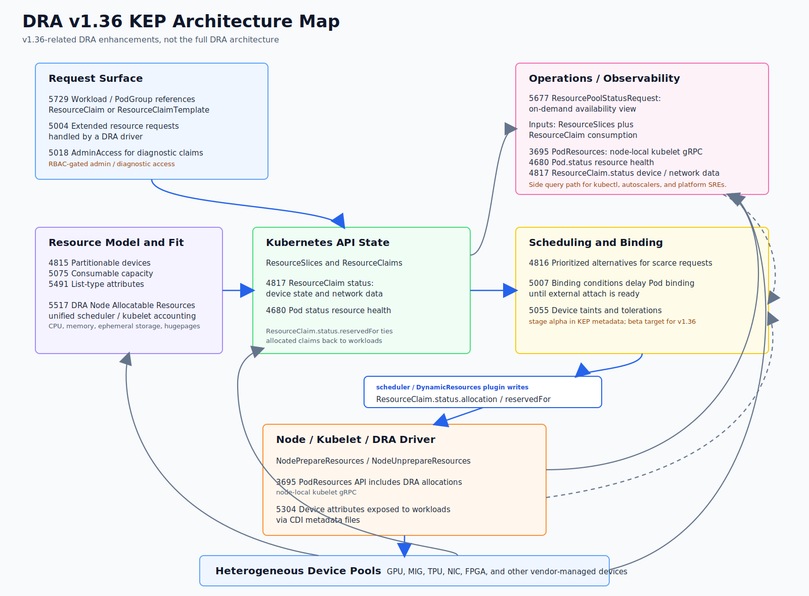

# Kubernetes v1.36 正式发布：ハル（Haru），飞向晴空

按官方发布页时间 2026 年 4 月 22 日 10:30（UTC-8）计算，北京时间 2026 年 4 月 23 日（周四），Kubernetes v1.36 正式发布。

此版本包含 69 项改进。在这些改进功能中，有 18 项已晋升为 Stable，有 24 项进入 Beta 阶段，有 25 项为 Alpha 阶段，2 项进入废弃阶段。

与前几个版本类似，v1.36 仍然延续了“稳定化 + 可扩展性 + 资源编排演进”的主线。本文会重点介绍 DRA 相关的一系列更新，以及 Workload Aware Scheduling（WAS，也就是 Workloads 感知调度）中的 Gang Scheduling 设计，然后按照 GA、Beta、Alpha 功能挑重点更新进行补充。

## 发布主题：ハル（Haru）

我们以 Kubernetes v1.36 开启 2026。这一版本伴随着季节更替而来，白昼渐长、万物转明。ハル（Haru）在日语中是一个富含多重意象的发音；其中我们尤为看重的包括：春（haru，spring）、晴（hare，晴空），以及遥か（haruka，远方、彼岸）。一个季节、一片天空、一条地平线——你将在下文中看到这三者的交汇。

> 图：Kubernetes v1.36 Logo，待补充。

该版本 Logo 由 Natsuho Ide（GitHub ID: `avocadoneko`）创作，其灵感源自葛饰北斋（Katsushika Hokusai）的《富岳三十六景》（Thirty-six Views of Mount Fuji）。这一系列也诞生了《神奈川冲浪里》（The Great Wave off Kanagawa）这样的经典之作。v1.36 的 Logo 对其中最著名的作品之一《凯风快晴》（Fine Wind, Clear Morning，又名《赤富士》）进行了再创作：夏日清晨，富士山被晨光染成赤红，积雪在长时间消融后已然褪去。“三十六景”与 v1.36 的数字形成了自然呼应，同时也提醒我们：即便是北斋，也并未止步于此 [1]。在这幅画面之上，Kubernetes 的船舵标志悬于天空，与富士山并立守望。

在富士山脚下，Stella（左）与 Nacho（右）静静而立，颈间佩戴着 Kubernetes 船舵徽章，象征着日本神社中成对守护的“狛犬”。成双成对，因为守护从来不是孤独完成的。Stella 与 Nacho 也代表着一个更为庞大的群体：SIG 与工作组、维护者与评审者、文档与博客与翻译的贡献者、发布团队、迈出第一步的新手，以及一季又一季持续回归的长期贡献者。Kubernetes v1.36，一如既往，是由无数双手共同托举起来的。

Logo 中“赤富士”之上挥洒着书法“晴れに翔け”（hare ni kake），意为“翱翔于晴空”。这其实是一副未能完整呈现在山体上的对联的上联：

```text
晴れに翔け、未来よ明け
hare ni kake, asu yo ake
飞向晴空，未来破晓。
```

这正是我们对这一版本的期许：无论是这个版本本身，还是整个项目，抑或是所有共同交付它的人，都能飞向晴空。赤富士上的破晓并非终点，而是一段通途——这个版本将我们带向下一个版本，再由下一个延伸至更远的未来，通向任何单一视角都无法穷尽的地平线。

- [1] 该系列大受欢迎，北斋后来又追加了十幅作品，总数达到四十六幅。
- [2] “未来”在此并非仅指“明天”，而是涵盖尚未到来的一切。通常读作 `mirai`，此处采用较为口语化的读法 `asu`。

## 重要系列

### DRA 1.36 一系列更新



> 图：DRA v1.36 相关 KEP 架构图，只覆盖 v1.36 相关 DRA 更新，不代表完整 DRA 架构。KubeCon + CloudNativeCon Europe 2026（阿姆斯特丹）WG Device Management 相关分享可参考议程链接：<https://sched.co/2EIbN>。

在 v1.36 中，DRA（Dynamic Resource Allocation）不是单点升级，而是一组资源编排能力的持续推进：`Extend PodResources`、`Prioritized Alternatives`、`AdminAccess` 等能力进入 Stable；`Resource Health Status`、`ResourceClaim Status`、`Extended Resource`、`Partitionable Devices`、`Device Taints`、`Binding Conditions`、`Consumable Capacity` 等能力进入 Beta；同时也开启了面向 Workload 级 ResourceClaim、CPU/内存等原生资源、资源池可见性、设备属性 List 类型等新能力。

篇幅有限，这里不会完整展开所有 DRA 细节。后续如果社区发布 DRA 专题博客，更适合单独逐项介绍。

| KEP | 标题 | 一句话介绍 | 1.36 更新 |
| --- | --- | --- | --- |
| 3695 | DRA: Extend PodResources to include resources from Dynamic Resource Allocation | 让节点监控或本地组件能通过 kubelet PodResources API 查询 Pod 通过 DRA 分配到的资源，补齐 DRA 资源可观测性。 | Stable |
| 4680 | Add Resource Health Status to the Pod Status for Device Plugin and DRA | 把 Device Plugin/DRA 设备健康状态暴露到 Pod Status，方便定位 Pod 崩溃或异常是否由设备故障导致。 | Beta |
| 4815 | DRA: Partitionable Devices | 支持 GPU MIG、TPU 等可分区或多主机逻辑设备，让 DRA 能表达动态分区并避免调度冲突。 | Beta |
| 4816 | DRA: Prioritized Alternatives in Device Requests | 允许 ResourceClaim 为一次设备请求声明按优先级排列的多种可接受设备选择，提升稀缺 GPU 等资源的可调度性。 | Stable |
| 4817 | DRA: Resource Claim Status with possible standardized network interface data | 允许 DRA driver 在 ResourceClaim status 写入已分配设备状态和标准化网络信息，方便排障和网络服务集成。 | Beta |
| 5004 | DRA: Handle extended resource requests via DRA Driver | 让现有 `nvidia.com/gpu: 2` 这类 extended resource 请求可由 DRA driver 满足，帮助应用和集群从 device plugin 平滑迁移到 DRA。 | Beta |
| 5007 | DRA: Device Binding Conditions | 对网络或织构附加设备等需要异步 attach 的资源，在外部资源确认 ready 前延迟 Pod binding，避免过早绑定后失败。 | Beta |
| 5018 | DRA: AdminAccess for ResourceClaims and ResourceClaimTemplates | 给集群管理员提供受控的 privileged ResourceClaim 模式，用于访问正在被用户使用的设备以做健康检查、诊断和监控。 | Stable |
| 5055 | DRA: Device Taints and Tolerations | 让 DRA driver 或管理员给设备打 taint，阻止新 Pod 使用异常或维护中设备，并允许 workload 用 toleration 明确接受。 | Beta |
| 5075 | DRA: Consumable Capacity | 支持多个独立 ResourceClaim 按容量份额共享同一底层设备，并在调度时校验总消耗不超过设备容量。 | Beta |
| 5304 | DRA: Device Attributes in Downward API | 通过 `PrepareResourceClaims` 返回设备 metadata，并由框架生成 CDI metadata 文件挂载给容器，解决 KubeVirt 等 workload 读取 PCIe 地址、UUID、网络属性的问题。 | Alpha |
| 5491 | DRA: List Types for Attributes | 让 ResourceSlice 的设备属性支持 typed list，并调整 `matchAttribute` / `distinctAttribute` 语义以表达 NUMA、PCIe root 等多值拓扑关系。 | Alpha |
| 5517 | DRA: Node Allocatable Resources | 当 CPU、Memory、Ephemeral-storage、Hugepages 等节点可分配资源也由 DRA 管理时，统一 scheduler / kubelet 资源记账，避免标准资源请求和 DRA 分配对同一物理资源重复计算导致超卖。 | Alpha |
| 5677 | DRA: Resource Availability Visibility | 为排障和容量规划提供 DRA 资源池剩余容量视图，通过 API 或控制器汇总 ResourceSlice 容量和 ResourceClaim 消耗。 | Alpha |
| 5729 | DRA: ResourceClaim Support for Workloads | 让 Workload / PodGroup 级对象声明 ResourceClaim 或 ResourceClaimTemplate，使一组 Pod 能共享或生成 DRA 资源声明。 | Alpha |

对平台团队来说，这组更新最直接的价值有三点：更灵活的资源回退与调度，提高稀缺资源利用率；更可观测的设备健康与容量状态，降低故障恢复成本；从加速卡扩展到原生资源的统一资源编排路径，为 AI 和大规模批处理场景打基础。

这部分内容比较多，可能比较适合单独详细的博客介绍。如果希望进一步了解 WG Device Management 维护者主题的上下文，可以查看 KubeCon 欧洲对应 PPT 完整版本，或者观看录像。

### WAS 一系列更新

WAS 也就是 Workload Aware Scheduling，是 SIG Scheduling 当前重点方向。在 v1.36 release highlights 讨论 `kubernetes/sig-release#2958` 中，WAS 关联了多个 KEP，包括 5832、5732、5729、5710、5547、4671。该方向的核心目标是让调度器更理解“工作负载级”约束，例如 PodGroup、拓扑放置与抢占协同。注意：`#2958` 是 release highlights 讨论，不是 WAS 的 KEP 编号。

| KEP | 标题 | 一句话介绍 | 1.36 更新 |
| --- | --- | --- | --- |
| 4671 | Gang Scheduling Support in Kubernetes | 提供 PodGroup / Gang Scheduling 基础语义，在满足 `minCount` 等组级条件前不绑定部分 Pod，避免分布式任务半启动造成资源浪费。 | Alpha 持续演进 |
| 5547 | WAS: Integrate Workload APIs with Job controller | 让 Job controller 能显式关联 Workload API，使 Job、Workload、PodGroup 的生命周期可以协同支持 gang scheduling。 | Alpha |
| 5832 | WAS: Decouple PodGroup API | 将 PodGroup 从 Workload 静态模板中解耦为独立运行时对象，为调度器和控制器共享组级调度状态打基础。 | Alpha |
| 5732 | Topology-aware workload scheduling | 为 PodGroup 生成并评分拓扑 placement，让一组 Pod 能按同一拓扑域协同放置，而不是逐个 Pod 独立最优。 | Alpha |
| 5710 | Workload-aware preemption | 把抢占决策从单个 Pod 扩展到 Workload / PodGroup 级别，减少“抢占了资源但整组任务仍放不下”的情况。 | Alpha |
| 5729 | DRA: ResourceClaim Support for Workloads | 让 Workload / PodGroup 级对象引用 DRA ResourceClaim 或 ResourceClaimTemplate，使整组 Pod 能共享或生成资源声明。 | Alpha |

> 图：Workload Aware Scheduling / PodGroup 调度流程，待补充。

Kubernetes v1.35 已经引入 Gang Scheduling 基础能力：调度器会先确认至少 `minCount` 个 Pod 可调度，再执行绑定。v1.36 在此基础上进一步推进：通过将 Workload 重构为静态模板、引入独立的 PodGroup 运行时 API，并在 kube-scheduler 中新增 PodGroup 调度周期，调度器开始具备以“整组工作负载”为单位进行原子调度的能力。

v1.36 同时带来了拓扑感知调度、工作负载感知抢占、面向 PodGroup 的 DRA ResourceClaim 支持，并启动 Job 控制器集成，为 AI/ML 与大规模批处理场景提供更强的原生调度基础。

Gang Scheduling / Workload Aware Scheduling 的最新进展，推荐观看上个月 KCD 北京上 DaoCloud 开源工程师范宝发的分享：<https://www.bilibili.com/video/BV1gZDLB4EZc>。他主要参与 Kubernetes SIG Storage，也是 kubeadm 的维护者。此外还可以观看 KubeCon 欧洲 SIG Scheduling 的维护者主题。后续社区也会有专门文章介绍这块，敬请期待。

### WAS 拓扑感知调度

对应 KEP 是 5732，在 v1.36 中是 Alpha 阶段。该功能目标是在同一拓扑域内协同放置整组 Pod，而不是逐个 Pod 独立最优，从而减少跨机架或跨可用区通信放大与工作负载碎片化。该特性受 `TopologyAwareWorkloadScheduling` 特性门控控制，当前为 Alpha，默认关闭。

从调度框架角度，v1.36 为 PodGroup 调度新增了 `PlacementGenerate` 与 `PlacementScore` 两个扩展点，并对应引入或扩展了关键插件：`TopologyPlacement` 负责生成候选拓扑域；`NodeResourcesFit` 对候选 placement 做资源利用评分，placement 场景使用 `MostAllocated` 逻辑；`PodGroupPodsCount` 按可成功放置 Pod 数量评分。

在 API 使用上，PodGroup 可通过 `schedulingConstraints.topology[].key` 声明拓扑约束，v1.36 仅支持单个 topology constraint。与 gang 策略配合时，调度器会先验证至少 `minCount` Pod 能否在同一拓扑域放下，再执行绑定；若无可行 placement，则整组不可调度。v1.36 的 TAS 不会触发 workload 或 pod preemption。生产建议是先在拓扑敏感场景灰度启用，例如分布式训练，重点观测跨域流量、任务完成时延和 pending 行为。

## 安装/升级注意事项

这些内容已经在 v1.36 的预览博客中介绍，这里简单提一下。具体内容可以参考：<https://mp.weixin.qq.com/s/_QyCzwjxDTe8_T-1ZIuq9A>，官方链接：<https://kubernetes.io/zh-cn/blog/2026/03/30/kubernetes-v1-36-sneak-peek/>。

### API 与对象兼容性

- `Service.spec.externalIPs` 在 v1.36 开始弃用并给出告警，计划在 v1.43 移除其功能实现，字段本身不会从 API 中移除。建议迁移到 `LoadBalancer`、`NodePort` 或 Gateway API（KEP-5707）。
- `gitRepo` 卷驱动在 v1.36 起永久禁用且不可重新启用。建议改为 `initContainer`、镜像构建阶段打包或外部 `git-sync`（KEP-5040）。
- 直接访问 `metav1.FieldsV1.Raw` 已弃用，应迁移到 `NewFieldsV1(string)`、`GetRawBytes()`、`GetRawString()`、`SetRawBytes()` 等访问方法。

### 升级窗口里需要提前检查的点

- 自定义监控或告警如果依赖 `volume_operation_total_errors`，需要改为 `volume_operation_errors_total`。
- 自定义监控或告警如果依赖 `etcd_bookmark_counts`，需要改为 `etcd_bookmark_total`。
- 自定义 scheduler PreBind 插件需要关注 v1.36 的并行 PreBind 变更。插件可通过 `PreBindPreFlight` 返回 `AllowParallel: true` 选择并行执行；已有插件实现也需要适配新的 `PreBindPreFlightResult` 返回值。
- kubeadm 不再内置 flex-volume 支持。仍依赖 flex-volume 的用户需要在升级前准备自定义 kube-controller-manager 镜像、显式传入 `--flex-volume-plugin-dir`，并通过 kubeadm `extraVolumes` 挂载对应目录。
- DRA driver 和控制器在 `DRAResourceClaimGranularStatusAuthorization` feature gate 启用时需要更细粒度的 ResourceClaim status RBAC，例如 `resourceclaims/binding` 与 `resourceclaims/driver` 子资源相关权限。

### 生态与运行时风险

- Ingress NGINX 已于 2026 年 3 月退役，不再提供后续修复和安全更新。现网虽可继续运行，但建议尽快完成迁移路线评估。
- SELinux volume relabeling 相关能力在 v1.36 进入 Stable，但后续版本仍可能带来行为变化。建议在升级前盘点工作负载对 SELinux 标签、挂载策略和共享卷的隐式依赖。

## GA 和稳定的功能

GA（General Availability）代表功能进入稳定阶段，有时候也用 Stable 表示，可作为生产可用能力评估。v1.36 的核心信号是：准入能力进一步完善，身份签名治理能力增强，节点与资源侧能力持续成熟。

### Mutating Admission Policies（KEP-3962）

过去很多团队依赖 mutating webhook 做策略注入、默认值补全和安全控制，但 webhook 体系本身有明显运维成本：需要额外部署与证书管理、故障会放大 API 请求路径风险、升级和排障链路也更长。对于多集群平台，这类“外置准入逻辑”通常是稳定性薄弱点之一。

v1.36 中，基于 CEL 的 Mutating Admission Policies 进入 GA，意味着“声明式、进程内”的变更准入能力进入稳定阶段。它与已 GA 的 Validating Admission Policy 形成闭环，让集群在“校验 + 变更”两个环节都能减少对外部 webhook 的硬依赖。对平台团队来说，最直接价值是把一部分高频、可声明化的准入逻辑收敛到 apiserver 内部能力，降低控制面外围组件复杂度。

### ServiceAccount Token 外部签名（KEP-740）

传统模式下，kube-apiserver 直接持有 ServiceAccount token 签名密钥，密钥生命周期与控制面节点绑定较深。对有合规要求或集中密钥管理要求的组织，这会带来审计、证书轮换、权限隔离上的治理压力。

KEP-740 的价值，在于把签名能力标准化地委托给外部系统（如 HSM、云 KMS），让 Kubernetes 与企业既有密钥治理体系对齐。它并不只是“换个签名位置”，而是把密钥保护边界、轮换流程和审计责任从单集群节点层面提升到统一安全基础设施层面。

### Volume Group Snapshot（KEP-3476）

多卷一致性恢复更可用。单卷快照难以覆盖多卷应用的一致性恢复诉求：当数据库数据卷、日志卷、元数据卷之间存在写入顺序关系时，分别快照往往无法保证同一恢复点。对训练平台、状态型中间件和复杂事务应用，这个问题在故障恢复时尤为明显。

Volume Group Snapshot 的核心价值，是把“多个相关卷”作为一个逻辑组进行快照与恢复，目标是提供 crash-consistent 的恢复点。它依赖 CSI 侧的一组扩展 API，能力边界清晰，也更利于存储厂商和平台团队在统一接口下协作。该功能在训练任务恢复场景中比较常见。

### 细粒度 Kubelet API 鉴权（KEP-2862）

该能力允许按请求类型（如 `exec`、`logs`、`metrics`、`port-forward`）进行更细粒度授权，而不是把 kubelet 端点访问作为粗粒度权限整体放开。它的实际意义是让节点侧接口更接近最小权限模型，降低“拿到一种权限即可过度访问”的风险。

### DRA AdminAccess for ResourceClaims（KEP-5018）

该特性支持以特权模式创建 ResourceClaim，用于在设备已被占用时执行管理类任务（如健康检查、状态查看）。对共享加速器环境而言，这有助于把“运维可见性”与“业务占用路径”解耦，减少排障时对业务负载的干扰。使用时，请确保只有需要的用户或自动化组件才被授权使用特权模式。

### Pod 在用户空间运行

User Namespaces 在 v1.36 进入 GA，且仅适用于 Linux 节点。其核心价值是将容器内的 UID/GID 与宿主机身份解耦：容器内看起来是 root（UID 0）的进程，在宿主机侧映射为非特权高位 UID，从而显著降低容器逃逸后的主机提权风险。

和 Beta 阶段的使用方式一致：在 Pod 或 PodTemplate 中设置 `hostUsers: false` 即可启用，无需改造镜像。启用后，类似 `CAP_NET_ADMIN` 这类能力会变为用户命名空间内的“局部能力”，可管理容器内资源但不会直接影响主机。配合 Linux 内核的 ID-mapped mounts，卷挂载不再依赖大规模 `chown`，在大卷场景下可明显改善启动与恢复效率。

### Node Log Query（Linux / Windows）

Node Log Query 在 v1.36 进入 Stable，意味着通过 kubelet `/logs` 查询节点服务日志的能力进一步固化。该能力覆盖 Linux 与 Windows 节点，并可处理系统日志提供器与文件日志路径。

从生产使用角度，仍需注意配置边界：能力稳定化不等于默认全面开放。`NodeLogQuery` feature gate 在 GA 后锁定启用，但系统日志查询仍依赖 kubelet 配置项，尤其是 `/var/log` endpoint 相关的 `enableSystemLogHandler` 与查询能力相关的 `enableSystemLogQuery`。这可以让故障排查更方便，但建议将其作为“故障排查开关”纳入运维手册，而不是长期默认暴露。

## 进入 Beta 阶段的功能

Beta 阶段功能通常已具备较高可用性，建议先在 staging 与灰度环境系统性验证，再分批引入生产。需要注意：功能阶段、feature gate 默认值和 API 是否默认启用不能简单等同，Beta 功能也需要逐项确认组件配置、feature gate 与 runtime config。

### 受限模拟（KEP-5284）

Constrained Impersonation 引入了一种受限的身份模拟机制，通过在 impersonation 流程中增加额外授权检查，使模拟者不仅需要具备“模拟目标身份”的权限，还必须具备“在该身份下执行具体操作”（`impersonate-on:<mode>:<verb>`）的权限，从而避免获得目标身份的完整权限能力。

该机制将传统的“全权限继承”模型转变为“受控委托（delegation）”，更符合最小权限原则，也使 impersonation 更适用于多租户平台和审计敏感的日常运维场景。

### IP/CIDR 验证改进（KEP-4858）

该改动收紧了非规范和歧义 IP/CIDR 写法的接受范围，减少不同实现间解释不一致引发的安全与互通问题。升级前建议先做配置巡检，清理历史遗留的“可解析但不规范”地址写法，避免在发布窗口触发阻塞。

### statusz / flagz（KEP-4827、KEP-4828）

核心组件的 `/statusz` 与 `/flagz` 能力升级到 Beta 且默认启用，使组件运行状态和关键配置暴露方式更一致。对平台可观测体系来说，这提升了控制面日常巡检和基线核对效率。

### Mixed Version Proxy（KEP-4020）

混合版本代理有时候也被称为未知版本互操作代理。该能力在版本偏斜（多个不同版本的 apiserver）场景下把请求转发到可处理该资源的 API Server，并提供更完整的聚合发现视图。它对“滚动升级中偶发 404 或发现不一致”的缓解价值较高，适合作为升级窗口稳定性增强项来评估。

### 控制器陈旧状态检修（KEP-5647）

KEP-5647 主要解决的是“控制器基于陈旧 cache 做决策”的问题。Kubernetes controller 通常通过 informer cache 读取对象状态，而这个 cache 来自 apiserver 的 watch stream，本质上是最终一致的；在大规模、高 churn 或 apiserver/watch 延迟场景下，controller 的本地视图可能落后于真实状态，进而导致重复 reconcile、错误删除 Pod、错误扩缩容或无意义写入。

该 KEP 的核心机制，是让 controller 能感知 informer cache 当前推进到的 `resourceVersion`，并在关键写入后记录对应的 `resourceVersion`；下一轮 reconcile 前，如果本地 cache 尚未追上前一次写入，就跳过本轮处理并 requeue，等 cache 追上后再继续。它的价值不是让所有 controller 都变成强一致，而是在高风险控制器和关键决策点上提供“读己之写”的保护，把原来依赖经验判断的 stale read 风险，转化为可检测、可等待、可回退的控制器机制。

### 其他值得关注的 Beta 更新

- `.kuberc` 继续处于 Beta，并在 v1.36 中增强了 credential plugin allowlist / denylist 策略能力。
- Suspended Job 的容器资源可变更进入 Beta，有利于队列系统或批处理平台在 Job 真正运行前按集群容量调整 CPU、内存、GPU 与 extended resource 请求。
- MemoryQoS 在 cgroup v2 节点上继续增强，提供更细的内存保护与配置能力。

## 进入 Alpha 阶段的功能

Alpha 功能默认关闭，建议仅在边界可控场景试点，并明确可观测基线、回滚路径和启停条件。WAS 前面已经做了介绍，DRA 也有部分能力在 v1.36 是 Alpha 阶段，这里不再赘述。

### HPA Scale to Zero

对应 KEP 是 2021，在 v1.36 中是 Alpha 阶段。HPA 在 Object/External metrics 场景支持从 0 到非 0 的伸缩能力，为事件驱动和低频工作负载提供更激进的成本优化空间。它不适用于 CPU/Memory 这类依赖运行中 Pod 的资源指标，而是更适合队列长度、外部事件积压量等可以在副本数为 0 时仍然被观测到的指标。试点时要重点关注冷启动时延、指标时效、误扩缩容保护和回滚路径。

### Server-side Sharded List/Watch

KEP-5866 主要解决的是“apiserver list/watch 流量无法真正水平分片”的问题。在大集群中，Pod 等核心资源事件量很高，很多控制器或观测组件希望通过多副本水平扩展来分摊压力；但传统 client-side sharding 下，每个副本仍然要从 apiserver 接收完整 watch stream，再在本地反序列化、过滤并丢弃不属于自己的对象。结果是副本数越多，整体网络、CPU 和内存浪费越大。

该 KEP 提出在 LIST/WATCH 请求中加入服务端分片能力，例如通过 `shardSelector` 指定 shard key 和 hash range，由 apiserver 在源头过滤对象和事件，使每个 watcher 只收到自己负责的 shard。它的效果是把“业务侧假分片”升级为“API Server 原生真分片”，降低 watch fan-out、客户端反序列化和无效事件处理成本，为 kube-state-metrics、未来 sharded controller 以及更大规模控制面提供基础扩展原语。

### CRI List Streaming

KEP-5825 则把类似问题放到节点侧处理：它为 kubelet 与容器运行时之间的 List 类调用引入服务端流式返回能力，避免一次性返回大量容器或镜像信息时造成 kubelet 内存峰值和响应延迟。节点上 Pod、容器和镜像数量越多，这类“单次大响应”的压力越明显。

KEP-5866 和 KEP-5825 都能够加强大规模集群控制面和节点稳定性。

### Native Histogram Support

v1.36 引入 Kubernetes 指标的 Native Histogram 支持（KEP-5808），让控制面组件可以导出更高分辨率的延迟分布数据。相比传统 Prometheus histogram 依赖固定 buckets 的方式，Native Histogram 使用更稀疏、动态的表达方式，在不显著增加手工 bucket 维护成本的情况下，提升对长尾延迟和突发抖动的观察能力。对平台团队来说，这项能力最直接服务于 apiserver 等核心组件的 SLI/SLO 建设。

### Manifest 驱动的准入控制配置

Manifest Based Admission Control Config（KEP-5793）是 Kubernetes 1.36 引入的 Alpha 能力，由 `ManifestBasedAdmissionControlConfig` feature gate 控制，主要作用于 kube-apiserver。它不是新增一种准入策略语言，而是为 admission webhook 和 CEL 准入策略提供一种 API 外部、manifest 化的配置来源：通过 `AdmissionConfiguration` 中的 `staticManifestsDir`，API server 可以在启动时从本地目录加载 `ValidatingWebhookConfiguration`、`MutatingWebhookConfiguration`、`ValidatingAdmissionPolicy` / `Binding`，以及后续达到 v1 后的 `MutatingAdmissionPolicy` / `Binding`，并在运行中监听文件变化后重新加载。

它解决的是 API 型准入配置的治理问题：避免关键准入配置在集群启动早期尚未创建或尚未生效，也降低其被 Kubernetes API 删除、修改或在 etcd 异常时不可用的风险。它和 Mutating Admission Policies 的关注点不同：MAP 关注“如何声明准入变更逻辑”，而 Manifest Based Admission Control Config 关注“准入配置从哪里加载、何时生效、如何作为平台级基线被保护”。对多集群平台而言，它适合用于安全基线、关键准入策略和 bootstrap 场景的配置治理；但由于仍处于 Alpha，且存在 HA 配置一致性、回滚、监控和若干功能限制，建议先用于测试集群和配置基线验证，不宜直接承载生产关键准入路径。

## DaoCloud 近期社区贡献

DaoCloud 在 Kubernetes 社区有很多参与，新增 Kueue 文档 Approver 李信和要海峰（CNCF 大使），目前 Kueue 的中文官方网站也已经上线：<https://kueue.sigs.k8s.io/zh-cn/docs/>。

此外，在 vLLM 社区，范宝发和卢传佳都成为了 vLLM Semantic Router 项目的 Committer。传佳还孵化了新项目 <https://github.com/clawwork-ai/clawwork>，作为 OpenClaw 的客户端，能够支持“多会话并行任务管理 + 多 Agent 协作编排 + 本地优先的任务/文件/上下文持久化工作流”。欢迎试用。

DaoCloud 近期还在孵化另一个云原生项目 MatrixHub：<https://github.com/matrixhub-ai/matrixhub>。该项目填补了企业级私有化大模型资产（模型、数据与版本）统一管理与分发基础设施的空白，敬请期待。

## 活动预告

- 6 月 18-19 日：KubeCon + CloudNativeCon India 2026，印度孟买
- 7 月 29-30 日：KubeCon + CloudNativeCon Japan 2026，日本横滨
- 9 月 8-9 日：KubeCon + CloudNativeCon China 2026，中国上海
- KubeCon + CloudNativeCon China 2026 CFP 截止日期为 5 月 3 日。此次大会还将同时同地举办 PyTorch Conference（目前 PyTorch 基金会项目包括 PyTorch、vLLM、SGLang 等）、OpenInfra Summit（前 OpenStack）、MCP Dev Summit。
- 11 月 9-12 日：KubeCon + CloudNativeCon North America 2026，美国盐湖城
- 11 月：KCD 2026 杭州
- 2027-2028 年已确定的 KubeCon 场次包括西班牙巴塞罗那（2027 欧洲）、美国新奥尔良（2027 北美）和德国柏林（2028 欧洲）。

## 发行说明

更多发布细节请参考 Kubernetes 主库和官方博客：

- Kubernetes v1.36 CHANGELOG：<https://github.com/kubernetes/kubernetes/blob/master/CHANGELOG/CHANGELOG-1.36.md>
- Kubernetes v1.36 release notes draft：<https://github.com/kubernetes/sig-release/blob/master/releases/release-1.36/release-notes/release-notes-draft.md>

## 历史文档

- K8s 1.35 发布！安装/升级变化巨大，新特性 Gang Scheduling 重磅来袭！
- 迎风破浪的三只熊——Kubernetes v1.34 发布，看点全解析
- 重磅！K8s 正式支持 Sidecar 容器，v1.33 版本这些改动将影响你的集群
- Kubernetes 1.32 还在写 Webhook? 你已经 OUT 了！
- Kubernetes 1.31 发布！十年 OCI 镜像借着 AI 的风终于加入 Volume 的大家庭
- 最可爱的版本 UwU - Kubernetes v1.30 发布！
- Kubernetes 1.29 全新特性：抛弃 iptables 还在等什么...
- Kubernetes 1.28 震撼发布，Sidecar Containers 迎面而来
- 近两年功能增加最多！Kubernetes 1.27 正式发布
- Kubernetes 正式发布 v1.26，稳定性显著提升
- Kubernetes 1.25 正式发布，多方面重大突破
- Kubernetes 1.24 走向成熟的 Kubernetes
- Kubernetes 1.23 正式发布，有哪些增强？
- Kubernetes 1.22 颠覆你的想象：可启用 Swap，推出 PSP 替换方案，还有……
- Kubernetes 1.21 震撼发布 | PSP 将被废除，BareMetal 得到增强

## 参考

1. Kubernetes v1.36 Sneak Peek <https://kubernetes.io/blog/2026/03/30/kubernetes-v1-36-sneak-peek/>
2. Kubernetes v1.36 主题讨论 <https://github.com/kubernetes/sig-release/discussions/2958>
3. Kubernetes v1.36 发布分支说明 <https://github.com/kubernetes/sig-release/blob/master/releases/release-1.36/README.md>
4. Kubernetes v1.36 变更日志 <https://github.com/kubernetes/kubernetes/blob/master/CHANGELOG/CHANGELOG-1.36.md>
5. Kubernetes v1.36 Release Notes Draft <https://github.com/kubernetes/sig-release/blob/master/releases/release-1.36/release-notes/release-notes-draft.md>
6. KEP 链接可以参考这个模式：KEP-5707 <https://kep.k8s.io/5707>
