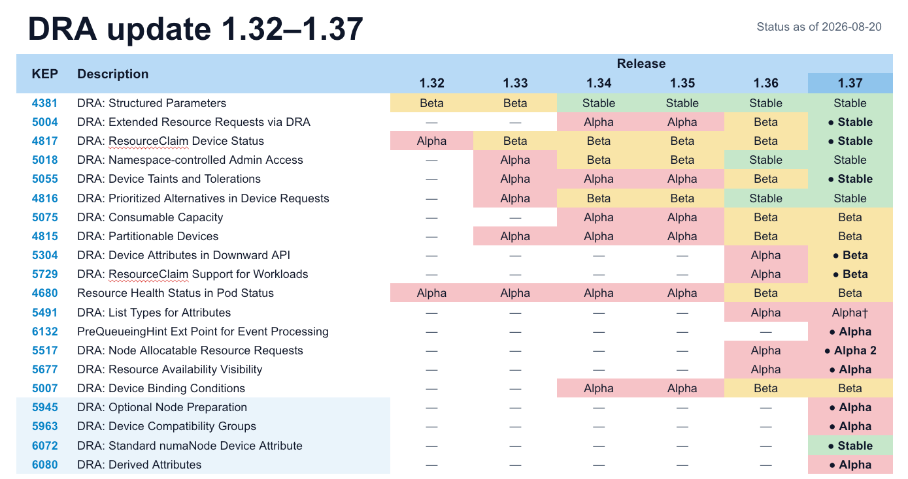
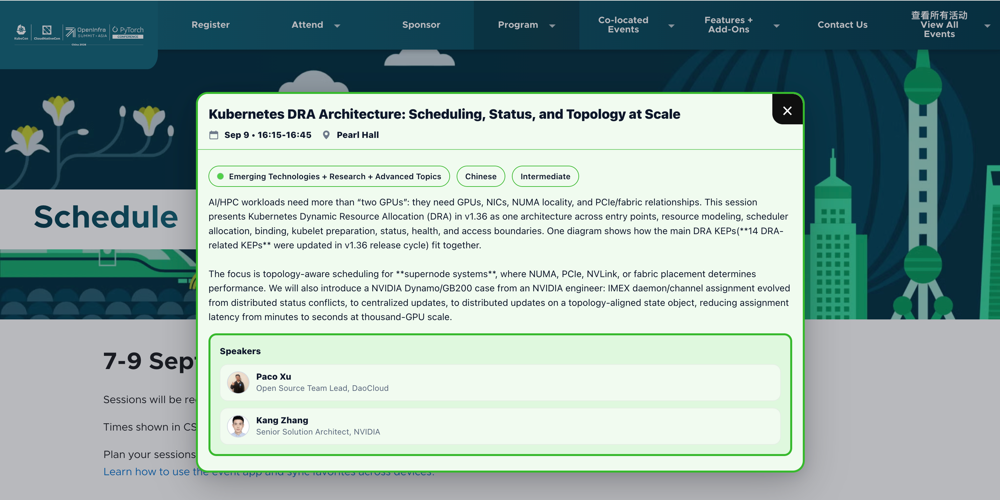
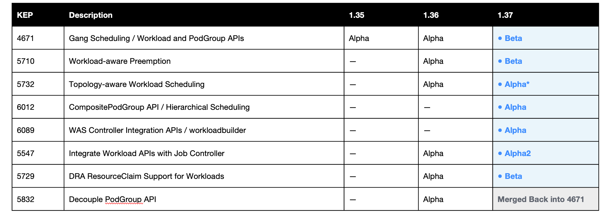

# Kubernetes v1.37 今晚发布：DRA 持续成熟，Workload-Aware Scheduling 进入 Beta

Kubernetes v1.37 计划于今晚也就是 2026 年 8 月 26 日（北美时间周三）凌晨正式发布。

本次版本更新包含 67 项改进。其中，16 项已升级至稳定版，23 项已升级至 Beta 版，27 项即将进入 Alpha 版，1 项为弃用/移除。

在这个版本里，WAS（Workload Aware Scheduling）核心能力进入 Beta，DRA 侧多项设备能力 GA，节点上的 Memory QoS、Rootless Kubelet、Pod 级资源管理持续优化，控制面则在启动、Watch 和恢复上也做了新一轮优化，大规模集群也会受益很多。

## 目录

- 专题一：DRA 从“能分配设备”走向平滑迁移和精细管理
- 专题二：Workload-Aware Scheduling——从单个 Pod 到整组工作负载
- GA 和稳定的功能
- 进入 Beta 阶段的功能
- 进入 Alpha 阶段的功能
- 其他值得关注的行为变化
- 删除和废弃功能
- 升级风险评估
- DaoCloud 开源与社区活动近期动态

## 专题一：DRA 从“能分配设备”走向平滑迁移和精细管理



DRA 核心框架在 v1.34 已经 GA，v1.35、v1.36 又陆续补上了设备健康、容量、分区、污点和工作负载级声明。到了 v1.37，讨论 DRA 不再只是“能不能用 ResourceClaim 申请一块 GPU”——更实际的问题是：老工作负载怎么平滑迁过来、设备坏了怎么管、不同厂商、可切分、拓扑复杂的设备怎么描述清楚。

### Extended Resource 兼容路径进入 GA

[KEP-5004](https://kep.k8s.io/5004) Extended Resources via DRA 在 v1.37 进入 GA。DRA driver 可以通过 DeviceClass 承接 `nvidia.com/gpu: 2`、`example.com/accelerator: 1` 这类传统 extended resource 请求；工作负载不需要先改写成 ResourceClaim，也不需要为同一种设备同时部署 Device Plugin 和 DRA 两套分配路径。

这项能力从 v1.35 Alpha、v1.36 Beta 一路走到 v1.37 Stable。对还在用 Device Plugin 的平台，它是一条很实用的迁移路径：应用 YAML 不用改，平台可以按节点池或设备类型，逐步把后端分配切到 DRA。等 driver、监控和故障处置都稳了，需要高级能力的新工作负载再直接上 ResourceClaim。

### 设备状态、故障隔离与拓扑表达继续稳定

v1.37 中几项已经成熟的能力把 DRA 从“分配接口”推进成“设备管理接口”：

| KEP | v1.37 阶段 | 解决的问题 |
| --- | --- | --- |
| [5004](https://kep.k8s.io/5004) Extended Resources via DRA | GA | 旧 extended resource 工作负载无需修改即可由 DRA driver 分配设备 |
| [5055](https://kep.k8s.io/5055) Device Taints and Tolerations | GA | 对单个故障或维护中的设备设置 taint，避免继续分配，而不是隔离整台节点 |
| [4817](https://kep.k8s.io/4817) ResourceClaim Device Status | GA | 由 driver 在 claim status 中报告设备状态和标准化网络接口数据，支撑 RDMA、多网卡与网络设备集成 |
| [6072](https://kep.k8s.io/6072) Standard `numaNode` Device Attribute | Stable | 统一使用 `resource.kubernetes.io/numaNode` 表达 NUMA 位置，让不同 driver 的设备能够比较拓扑关系 |

其中 `numaNode` 直接以 Stable 落地，因为它标准化的是设备属性名称，没有独立特性门控，也不改变内置分配行为。它看似只是命名约定，却为 GPU、NIC、TPU 等来自不同 driver 的设备做同 NUMA 节点放置提供了共同语言。

### Workload 级 ResourceClaim 连接 DRA 与 WAS

[KEP-5729](https://kep.k8s.io/5729) 在 v1.37 进入 Beta。开启默认关闭的 `DRAWorkloadResourceClaims` 后，Workload 或 PodGroup 可以直接引用 ResourceClaim，让一份 claim 按工作负载生命周期创建并由整组 Pod 共享，不再受旧的逐 Pod reservation 数量限制。这对于共享 GPU 分区、RDMA 接口或一组训练进程共同使用的设备尤其重要。

v1.37 还收紧了关闭 gate 时的行为：如果 Pod 引用的 ResourceClaimTemplate 与 PodGroup 中的声明匹配，但 `DRAWorkloadResourceClaims` 没有启用，系统不会退化成“为每个 Pod 各建一份 claim”。这避免了原本面向整组共享的设备声明被批量复制，进而耗尽 DRA 资源。

### 其他 Beta 能力补齐设备使用链路

除了工作负载级 ResourceClaim，v1.37 的 DRA 还有一组 Beta 能力覆盖设备信息注入、共享容量、动态分区、健康状态和绑定时序：

| KEP | v1.37 阶段 | 解决的问题 |
| --- | --- | --- |
| [5304](https://kep.k8s.io/5304) Device Attributes Downward API | Beta | 将 driver 在 claim preparation 阶段生成的设备 metadata 通过 CDI JSON 文件注入容器，工作负载无需额外 controller 即可读取 PCI 地址、MAC 等设备信息；该能力没有独立特性门控 |
| [5075](https://kep.k8s.io/5075) Consumable Capacity | Beta | 允许多个独立 ResourceClaim 从同一设备的可消费容量中分配份额，例如共享网络带宽或虚拟 GPU 内存 |
| [4815](https://kep.k8s.io/4815) Partitionable Devices | Beta | 描述 GPU、TPU 等设备的可切分结构和多主机拓扑，让工作负载请求具体分区而不是无关设备的组合 |
| [5007](https://kep.k8s.io/5007) Device Binding Conditions | Beta | 在外部设备真正准备完成前延迟 Pod 与节点的绑定，并在准备失败或超时时重新调度 |
| [4680](https://kep.k8s.io/4680) Resource Health Status | 待最终确认 | 把 Device Plugin 和 DRA 设备健康暴露到 Pod/容器状态；当前 `release-1.37` 代码仍为 Beta、默认启用，但正式发布公告草稿将其列入 Stable |

KEP-4680 与已经 GA 的 KEP-4817 容易混淆：前者关注 Pod 和容器看到的设备健康，后者提供的是 `ResourceClaim.status.devices` 中由 driver 报告的设备状态和标准化网络接口数据。由于官方发布公告、DRA 专题草稿、KEP 元数据与当前 release 分支尚未完全一致，本文暂不把 KEP-4680 明确写成 GA，正式发布时需要再次核对 CHANGELOG 和特性门控定义。

### Alpha 探索转向复杂设备模型

v1.37 的 DRA Alpha 工作大多围绕“属性、容量和兼容性”展开：

- [KEP-5491](https://kep.k8s.io/5491) List Types for Attributes 进入第二轮 Alpha，让设备属性可以保存多个值，例如一颗 CPU 同时邻接多个 PCIe root；
- [KEP-5517](https://kep.k8s.io/5517) Node Allocatable Resource Requests 进入第二轮 Alpha，尝试让 DRA 管理的 CPU、内存等节点资源参与 scheduler 与 kubelet 的常规资源核算，避免在 ResourceClaim 和 Pod resources 中重复申请；
- [KEP-5677](https://kep.k8s.io/5677) Resource Availability Visibility 继续 Alpha，目标是在 `kubectl describe resourceslice` 和 `kubectl describe node` 中展示设备池的实际剩余容量，而不只是总容量；
- [KEP-5945](https://kep.k8s.io/5945) Optional Node Preparation 允许对无需节点本地初始化的分配跳过 kubelet prepare/unprepare 调用，减少不必要的 driver 依赖；
- [KEP-6080](https://kep.k8s.io/6080) Derived Attributes 允许用 CEL 归一化不同 driver 的属性，既能把 `numa` 与 `numaNode` 之类的命名差异映射起来，也能从复杂拓扑字符串中提取标识或生成性能分层；
- [KEP-5963](https://kep.k8s.io/5963) Device Compatibility Groups 为共享同一容量计数器的可分区设备补充兼容约束，让 scheduler 在调度阶段拒绝互斥的设备模式，而不是等到节点 prepare 时才失败；
- [KEP-6132](https://kep.k8s.io/6132) Scheduler PreQueueingHints 为 scheduler 事件处理增加新的 Alpha extension point，使 ResourceClaim 变化只重新排队真正受影响的 Pod。它是 scheduler 性能能力，不是新的 DRA API。注意该功能本来是直接进入 Beta 阶段，因为发现存在一些 Bug 还未修复，所以又退回了 Alpha。

这些 Alpha 能力仍默认关闭，API 也可能继续调整。如果要在 AI 平台上试 DRA，v1.37 更值得验证的是迁移、观测、故障隔离和复杂拓扑这几条链路，而不只是看第一次 GPU 能不能分配成功。故障演练建议至少覆盖：设备不健康、driver 重启、ResourceSlice 重建、PodGroup 共享 claim、节点维护，以及 DRA 调度回退。

另外，9月9日的上海 KubeCon 中，我会和 NVIDIA 的 Kang Zhang一起做 DRA 相关分享，总体介绍目前的 DRA 和 WAS 如何配合来调度 AI 工作负载以及实战经验，欢迎大家前来参加。
https://www.lfopensource.cn/kubecon-cloudnativecon-openinfra-summit-pytorch-conference-china/program/schedule/?id=1223308




## 专题二：Workload-Aware Scheduling——从单个 Pod 到整组工作负载

kube-scheduler 默认是一个 Pod 一个 Pod 地调度。分布式训练、MPI、大规模批处理这类任务，往往需要一批 Pod 一起跑起来。实际集群里却经常出现：几个 Pod 已经占上了 GPU，剩下的 Member 长期 Pending，任务既开不了，也撤不掉。

v1.36 用 WAS 把 Workload、PodGroup、Gang Scheduling、拓扑感知调度、工作负载感知抢占这些能力搭成了 Alpha 框架。v1.37 继续往前推：核心 API、Gang Scheduling 和工作负载感知抢占都到了 Beta。



### Workload 与 PodGroup 核心 API 进入 Beta

[KEP-4671](https://kep.k8s.io/4671) 把 Workload 和 PodGroup 核心 API 提升到 `scheduling.k8s.io/v1beta1`。简单说，Workload 管模板和调度意图，PodGroup 管一组 Pod 的运行时状态。开了 Gang policy 之后，scheduler 会先确认至少 `minCount` 个成员能一起放下，再统一调度、统一绑定。

核心能力走 `v1beta1`；CompositePodGroup 等还在试验阶段的扩展走 `scheduling.k8s.io/v1alpha3`。旧的 `v1alpha2` 已经移除——如果你在 v1.36 试过 WAS，升级前不能只改特性门控，还得清理旧对象、迁 API 版本。

v1.37 内部调度模型也有变化：PodGroup 成了调度队列里的一等公民，成员 Pod 不再各自排队。整组共享等待、退避和调度周期，后面做更复杂的组级策略也更顺手。另外，`minCount` 现在可以改了，弹性 gang 可以在不打断已运行 Pod 的前提下缩小或扩大最小规模。

这些能力统一由 Beta gate `GenericWorkload` 控制，`GangScheduling` 和 `WorkloadAwarePreemption` 两个旧 gate 已合并进来。注意：`GenericWorkload` 在 v1.37 仍默认关闭。Beta 说的是 API 和实现更成熟了，不是升级后所有集群的调度方式都会自动变。

### 抢占也要算整组工作负载

[KEP-5710](https://kep.k8s.io/5710) 把工作负载感知抢占也带到了 Beta。平时 kube-scheduler 抢占低优先级 Pod，为的是给某一个高优先级 Pod 让出资源。WAS 场景下，调度器要腾出的不是单个 Pod 的份额，而是要让一整个 PodGroup 凑齐 `minCount` 个成员，还要满足拓扑等放置要求——该牺牲哪些低优先级工作负载，得按整组来算。

v1.37 在这条路上又补强了几个方面：

- scheduler 会先模拟移除候选 victim，只跑一遍开销较大的放置算法；后面 reprieve 阶段直接复用结果，少做重复求解；
- 普通 Pod 抢占也会识别 PodGroup，尊重 `disruptionMode`，避免“要求整组一起停”的工作负载只被拆掉其中一个 Pod；
- Beta API 把原来的 `PodGroup` / `Pod` disruption mode 改成了更通用的 `All` / `Single`，方便 PodGroup 和 CompositePodGroup 共用同一套语义。开了 `PodGroupPreemptionPolicy` 之后，还可以在 PodGroup 层声明是否允许主动抢占别人。

### 用 CompositePodGroup 描述多层结构

单层 PodGroup 能表达“8 个 worker 一起启动”，但 JobSet、LeaderWorkerSet、分离式推理这类场景往往是多层结构。[KEP-6012](https://kep.k8s.io/6012) 在 v1.37 以 Alpha 引入 `CompositePodGroup`：把 PodGroup 和 CompositePodGroup 组织成一棵树，父组用 `minGroupCount` 约束至少要几个子组，叶子 PodGroup 再用 `minCount` 约束成员数量。

scheduler 从根往下检查整棵树。各层策略都满足，整棵层级里的 Pod 才会一起绑定；否则全部继续 Pending，避免出现“driver 已经跑了、worker 却不够”或者“prefill 占了设备、decode 子组起不来”的半成品。抢占时可以选 `Single`，只动某一个子组；也可以选 `All`，层级里任一成员要被抢占，就按整棵子树处理。

配套的 [KEP-5732](https://kep.k8s.io/5732) 多层拓扑感知调度也在 Alpha。比如父组要求整个工作负载落在同一可用区，子组再要求落在该可用区内的同一机架。scheduler 按“可用区 → 机架”自上而下收窄候选域，比把约束全摊到单个 Pod 上，更接近训练和推理系统的真实结构。

### 控制器接入：共用一套积木，别各自造轮子

[KEP-6089](https://kep.k8s.io/6089) 在 v1.37 以 Alpha 提供了一组可复用的调度 builder，放在 `scheduling.k8s.io/v1alpha3` 里：basic/gang policy、拓扑约束、`Single`/`All` disruption mode、工作负载级 ResourceClaim 等。单层 PodGroup 用 `WorkloadPodGroup*` 类型，分层工作负载用 `WorkloadCompositePodGroup*`；控制器复用同一套结构和语义，字段怎么命名、怎么嵌套，按自己的领域模型来定。

这些 building blocks 和 [`workloadbuilder`](https://github.com/kubernetes/kubernetes/tree/release-1.37/staging/src/k8s.io/component-helpers/scheduling/schedulingv1/workloadbuilder) Go 库没有独立特性门控。`workloadbuilder` 负责合并默认值和用户配置、按 allow-list 拒绝尚未支持的 policy 或 disruption mode，并构造 Workload、PodGroup 或 CompositePodGroup；对象的生命周期仍由接入的控制器自己管。

对 JobSet、LeaderWorkerSet、RayJob 这类分层控制器，建议最上层的根控制器作为整棵工作负载树的唯一“编译器”，只生成一份 Workload；子控制器可以创建对应的运行时 PodGroup，但不要重复生成 Workload。KEP-6089 在 v1.37 提供的是积木、库和接入规范——不等于这些 out-of-tree 控制器已经自动接好了。

### Job 控制器首次使用新的调度 builder

原生 Job 控制器是第一批吃螃蟹的。[KEP-5547](https://kep.k8s.io/5547) 在 v1.37 进入 Alpha2，给 Job 加了实验性的 `.spec.scheduling`：可以显式选 gang scheduling、拓扑和 disruption mode。不填 `.spec.scheduling` 时走 Basic policy，行为和现在一样，还是逐 Pod 调度。选了 gang 但没写 `minCount`，Job controller 默认用 `parallelism`。

开了 `WorkloadWithJob` 之后，就算 Job 没填 `.spec.scheduling`，controller 也会创建 Basic Workload 和 PodGroup，并给 Pod 写上 `.spec.schedulingGroup.podGroupName`。Basic 不代表“没有 gang 门槛就不创建 WAS 对象”——对象还是会建，只是不强制 `minCount`。

下面的精简示例要求 4 个 Pod 以 gang 方式调度、落入同一个可用区，并在抢占时作为整体处理：

```yaml
apiVersion: batch/v1
kind: Job
metadata:
  name: distributed-training
spec:
  parallelism: 4
  completions: 4
  scheduling:
    schedulingPolicy:
      gang: {}
    schedulingConstraints:
      topology:
        - key: topology.kubernetes.io/zone
    disruptionMode:
      all: {}
  template:
    spec:
      restartPolicy: Never
      containers:
        - name: worker
          image: example.com/training-worker:v1
```

这里需要使用最终合入的 `schedulingPolicy`、`schedulingConstraints.topology[].key` 和 `disruptionMode` 字段。当前 Alpha API 中，一个 group 最多配置一个 topology constraint，Job 最多配置 4 个共享 ResourceClaim；除了 `schedulingPolicy.gang.minCount` 可以调整，`.spec.scheduling` 是否存在、policy 类型、拓扑、disruption mode 和 ResourceClaim 列表在创建后都不可变。使用工作负载级共享 ResourceClaim 还需要额外启用 `DRAWorkloadResourceClaims`。

`WorkloadWithJob` 只管 Job API 和 Job controller 这条集成线，不管 KEP-6089 的 building blocks 或 `workloadbuilder`。所以 Workload API 进了 Beta，不等于 Job 集成或 Controller Integration APIs 也是 Beta。

### 如何启用和验证

WAS 在 v1.37 里既有 Beta 核心，也有 Alpha 扩展。只开一个 gate，并不会自动拿到全部能力：

| 特性门控 | 阶段 / 默认值 | 需要启用的组件 | 能力 |
| --- | --- | --- | --- |
| `GenericWorkload` | Beta / 默认关闭 | kube-apiserver、kube-controller-manager、kube-scheduler | Workload、PodGroup、Gang Scheduling 与工作负载感知抢占 |
| `PodGroupPreemptionPolicy` | Alpha / 默认关闭 | kube-apiserver、kube-scheduler | 在 PodGroup 层声明是否允许主动抢占其他工作负载 |
| `DRAWorkloadResourceClaims` | Beta / 默认关闭 | kube-apiserver、kube-controller-manager、kube-scheduler、kubelet | Workload / PodGroup 共享 ResourceClaim |
| `TopologyAwareWorkloadScheduling` | Alpha / 默认关闭 | kube-apiserver、kube-scheduler | 单层和多层拓扑感知放置 |
| `CompositePodGroup` | Alpha / 默认关闭 | kube-apiserver、kube-controller-manager、kube-scheduler | 分层工作负载与组级策略 |
| `WorkloadWithJob` | Alpha / 默认关闭 | kube-apiserver、kube-controller-manager | Job `.spec.scheduling` 集成 |

建议先在专用的 AI 或批处理测试集群里看队列等待、PodGroup 调度成功率、抢占后的任务完成时间、拓扑求解开销和 ResourceClaim 生命周期。如果已经在用 Kueue、Volcano 或自研调度器，最好先想清楚：准入排队、配额、Gang Scheduling、节点放置，分别由谁负责，避免两套系统管同一层决策。

## GA 和稳定的功能

### Metrics API 终于进入 v1（KEP-5207）

`metrics.k8s.io` 从 v1.8 起长期处于 `v1beta1`，在 v1.37 进入 Stable 并提供 `v1` API。HPA 与 `kubectl top` 都依赖这套标准的 Pod/Node CPU、内存指标接口。

这次升级不改变 API 结构，`v1` 与 `v1beta1` 会在迁移期并存，因此现有客户端不需要在升级当天强制切换。它更像是对多年生产使用事实的正式确认，但 API client 和 metrics-server 仍应逐步切换到 `v1`。

### Pod Certificates 与 ClusterTrustBundles 进入 GA（KEP-4317、KEP-3257）

Pod Certificates 允许工作负载通过 projected volume 请求和轮换 X.509 证书，签发器则通过 `PodCertificateRequest` 完成签名。ClusterTrustBundle 提供集群级信任锚分发机制，让 Pod 按 signer 选择并挂载 CA bundle。

两者组合后，平台无需在每个 namespace 复制 CA ConfigMap，也不必把长期静态证书烘进镜像。它们为 Pod mTLS、SPIFFE 风格身份和企业内部 PKI 集成提供了更标准的 Kubernetes API 路径。

进入 GA 不代表集群会自动拥有签发系统。平台仍需部署 signer/controller，设计 signerName、RBAC、证书生命周期、吊销和审计策略。

### HPA 可配置容差进入 GA（KEP-4951）

HPA 可以分别配置 scale-up 和 scale-down tolerance，不再只能依赖 controller-manager 的全局容差。对于波动较大的在线业务，可以提高缩容容差来减少抖动；对于突发流量敏感业务，则可以降低扩容容差来更快响应。

建议结合指标采样周期、stabilization window 和业务冷启动时间一起调优，避免只调 tolerance 造成频繁扩缩容。

### Storage Version Migrator 内置化进入 GA（KEP-4192）

Storage Version Migration 成为内置控制面能力，`storagemigration.k8s.io/v1` 默认可用。它可以把 etcd 中仍以旧 storage version 保存的对象重写到当前版本，对 API 版本演进和静态数据加密密钥轮换都很重要，也减少了部署外部 migrator 的运维成本。

v1.37 还为迁移状态增加进度信息。大型集群应关注迁移对 API Server 与 etcd 的写入压力，并分批验证 CRD、聚合 API 和密钥轮换流程。

### Resilient Watch Cache Initialization 进入 GA（KEP-4568）

Watch cache 初始化不再在 API Server 启动或恢复时向 etcd 形成明显的惊群压力，请求也能在 cache 预热期间更平稳地处理。它与 v1.37 的 Concurrent Watch Object Decode、Etcd RangeStream 一起构成控制面启动和恢复优化主线。

cache 预热期间，API Server 可能对超出安全处理范围的请求返回 HTTP `429 Too Many Requests`。自研 controller 和 operator 应尊重 `Retry-After`，并使用指数退避，避免恢复阶段再次形成请求洪峰。

### Node Declared Features 进入 GA（KEP-5328）

节点可以在 Node status 中声明实际支持的能力，调度器据此过滤不具备所需功能的节点。这解决了特性门控已在控制面开启，但混合版本节点、运行时或操作系统实际能力不同的问题，为更快、更安全地推广节点特性提供基础。

### KYAML 输出进入 Stable（KEP-5295）

支持 `--output` 的 kubectl 命令可以使用 `-o kyaml`。KYAML 通过更明确的字符串和数字表示减少 YAML 1.1 中常见的隐式类型陷阱，例如把 `NO` 解析成布尔值的“Norway problem”。

它是新的输出格式，不会替换现有 `-o yaml`。对配置生成、代码评审和 GitOps 流程来说，更适合先比较 diff 和下游解析器兼容性，再决定是否作为默认导出格式。

更多内容可以阅读 [How to Pretty-Print Your Kubernetes YAML as KYAML and Why You'd Want To](https://kubernetes.io/blog/2026/08/11/how-to-pretty-print-kubernetes-yaml-as-kyaml/) 这篇博客。

### 其他进入 GA 的 API 与行为

- [KEP-3085](https://kep.k8s.io/3085) 将 Pod sandbox 创建和网络就绪状态通过 `PodReadyToStartContainers` condition 暴露给用户与 controller，便于区分 sandbox 尚未准备和容器自身启动失败。
- [KEP-4762](https://kep.k8s.io/4762) 允许把任意合法 FQDN 设置为 Pod hostname，解除此前 hostname 必须是单个 DNS label 的限制；
- [KEP-5311](https://kep.k8s.io/5311) 放宽 Service 名称校验，使 Service 名称可以从数字开始，同时仍遵循对应的 DNS 名称规则；

## 进入 Beta 阶段的功能

### Kubelet in User Namespace / Rootless Mode（KEP-2033）

该能力允许 kubelet 和同一节点命名空间内的 CRI、OCI、CNI 等组件在 Linux user namespace 中以宿主机非 root 用户运行，同时在 namespace 内保留所需的 root 语义。这样可以缩小节点组件漏洞影响宿主机的范围。

v1.37 中相关 gate 进入 Beta 并默认启用，但这只表示支持能力可用，不会自动把现有节点改造成 rootless。节点 user namespace、运行时、网络、挂载、设备访问和 systemd 服务仍需要按发行版逐项配置与验证。

### Memory QoS（KEP-2570）

Memory QoS 在经历多轮 Alpha 设计和回滚安全改进后进入 Beta，基于 cgroup v2 的 `memory.min`、`memory.low` 和 `memory.high` 提供分层内存保护与节流。

v1.37 默认启用该能力的支持，但关键保护和节流行为仍由 kubelet 配置控制。建议使用 Linux 5.9+ 内核和支持 cgroup v2 的运行时，在内存压力测试中关注延迟、reclaim、OOM、`memory.events` 以及关闭特性门控后旧 cgroup 值能否正确清理。

### HPA Scale to Zero（KEP-2021）

HPA 从 Alpha 进入 Beta，可以在 Object 或 External metrics 场景将工作负载从 0 扩到非 0，再缩回 0。它适合队列积压、事件数量等即使没有运行中 Pod 也能观测的指标，不适用于需要从 Pod 采集的 CPU/内存指标。

生产评估应重点关注冷启动时间、指标断流、最大扩容速度和“0 副本时监控链路是否仍然存在”。

### Pod 级资源管理继续成熟（KEP-2837、KEP-5526）

`PodLevelResources` 在 v1.37 release 分支中仍保持 Beta；v1.37 新增了默认值和 QoS 计算修复。基于它的 Pod Level Resource Managers 从 Alpha 进入 Beta，让 Topology、CPU 和 Memory Manager 可以围绕 `pod.spec.resources` 做 NUMA 对齐，并在 Pod 内划分容器独占资源和共享池。

需要注意，`PodLevelResourceManagers` 在 v1.37 仍默认关闭，并依赖 `PodLevelResources`。HPC、AI/ML 和 NFV 场景可以试点，普通工作负载不需要为升级主动启用。

### CRI Stats（KEP-2371）

kubelet 从 CRI 获取 Pod 和容器统计信息的能力进入 Beta，继续减少对内嵌 cAdvisor 采集路径的依赖。运行时必须正确实现对应 CRI stats 接口，平台也需要比较切换前后的指标完整性、标签、采样延迟和资源开销。

### Route controller 改用 Watch 驱动（KEP-5237）

cloud-controller-manager 的 route controller 从固定周期轮询改为由 Node 的新增、删除、地址和 Pod CIDR 变化触发 reconciliation，同时保留低频周期检查作为兜底。这可以减少无变化时对云厂商 API 的请求，并让新节点路由更快进入一致状态；私有云 provider 需要确认自身 route 实现和事件突发时的限流行为。

### 存储侧 Beta 更新

- [KEP-4049](https://kep.k8s.io/4049) Storage Capacity Scoring：调度器在动态制备卷时可按可用存储容量为节点打分；
- [KEP-5030](https://kep.k8s.io/5030) CSI Volume Attach Limits 与 Cluster Autoscaler 集成：扩容决策能考虑节点可附加卷数量，减少扩容后仍无法调度；
- [KEP-5541](https://kep.k8s.io/5541) PVC Unused Since Time：PVC status 增加 `Unused` condition，帮助发现长期未使用的卷，但不能直接替代业务确认和回收策略。

### API Server、控制器与可观测性 Beta 更新

- Concurrent Watch Object Decode（KEP-6178）默认启用，通过有界 worker pool 并行解码和转换 etcd watch event，同时保持事件顺序；使用 CRD conversion webhook 的集群要关注初始化期间并发调用上升；
- Etcd RangeStream（KEP-5966）使用单个流式 RPC 初始化 watch cache，减少分页 Range 请求和内存峰值；使用该新路径需要 etcd 3.7+，连接旧版 etcd 时 API Server 会在收到 `Unimplemented` 后自动回退到 unary `Range`，并不构成 v1.37 升级的硬性 etcd 版本要求；
- Stale Controller Mitigation（KEP-5647）继续提供 controller cache 陈旧度指标与 read-your-own-writes 保护；
- Manifest-Based Admission Control Config（KEP-5793）允许 API Server 从本地 manifest 加载 webhook 和 admission policy，使关键准入控制在首个请求前生效，且不能通过 Kubernetes API 删除；HA 集群必须保证所有 API Server 文件一致；
- Handling Undecryptable Resources（KEP-3926）让管理员通过 API 识别和清理因 KMS key 丢失等原因无法解密的对象，减少直接操作 etcd 的需要；
- Prometheus Native Histogram（KEP-5808）进入 Beta；迁移期应确认 Prometheus、远端存储、查询、告警和 dashboard 兼容，并保留 classic histogram 以避免现有规则失效。

## 进入 Alpha 阶段的功能

Alpha 功能默认关闭，API 和行为可能在后续版本不兼容变化。v1.37 的新 Alpha 数量较多，本文只选择与私有云、AI 平台和节点运维关系更直接的能力。

### Pod-Level Checkpoint / Restore（KEP-5823）

过去的 checkpoint 能力以单容器为中心，难以恢复同一 Pod 内共享的网络、IPC 和生命周期状态。Pod-Level Checkpoint / Restore 试图把整个 Pod 作为 checkpoint 单元，为长时间训练、批处理迁移、快速预热、故障分析和取证提供基础。

这项能力依赖 CRIU、容器运行时和节点内核，安全面也很大。当前更适合在隔离测试环境验证 checkpoint 文件保护、跨节点兼容性、外部存储和恢复后的网络身份，不应直接作为生产容灾承诺。

### Volume Health Monitor（KEP-1432）

该 KEP 在重新设计后回到 Alpha，引入 CSI controller / node 侧健康 RPC，把卷或存储后端的 `Inaccessible`、`DataLoss`、`Degraded` 等状态写入 Kubernetes 可读状态。它解决的是“PVC 仍然 Bound，但底层磁盘已损坏或不可达”的观测盲区。

v1.37 只建立标准信号，不定义自动修复动作。平台仍需结合 CSI driver、告警、Pod disruption 和业务数据恢复策略决定如何响应。

### StatefulSet Recreate 更新策略（KEP-3541）

StatefulSet 新增类似 Deployment 的 `Recreate` 策略：删除全部旧 Pod、等待终止完成，再按 `podManagementPolicy` 创建新版本。它能绕过部分 RollingUpdate 卡住的问题，但会主动造成服务中断。

只有能够接受停机、且数据由 PVC 或外部系统可靠保存的工作负载才适合试验。数据库、共识系统和有顺序约束的集群还需要额外验证 fencing、quorum 与恢复顺序。

### 调度与设备管理的 Alpha 延伸

CompositePodGroup、Controller Integration APIs、Job 集成，以及 DRA Derived Attributes、Device Compatibility Groups、Node Allocatable Resource Requests 等能力，已经在前面的 DRA 与 Workload-Aware Scheduling 两个专题中展开，这里不再重复。除此以外，Scheduler Preemption for In-Place Pod Resize 允许为高优先级 Pod 的 Deferred resize 抢占低优先级 Pod，补齐原地扩容在资源不足时的抢占路径。

### 节点、网络与安全探索

- Dynamic Resize of Memory-backed Volumes：通过 Pod `/resize` 子资源原地调整 `medium: Memory` 的 emptyDir `sizeLimit`；
- Specialized Lifecycle Management for Nodes（KEP-5683）：为 Node 定义 Kubernetes 已知的生命周期 conditions，让核心 controller、云平台和运维工具共享统一的节点生命周期状态；
- Default Pod Sysctls：由 kubelet 为节点或节点池上的 Pod 设置默认 sysctl，Pod 显式配置仍可覆盖；
- gRPC Probe TLS 与 HTTP/2 cleartext probe：扩展 kubelet 原生探针协议能力；
- Volume Bind Mount Options：为容器的 volumeMount 增加 `noexec`、`nodev`、`nosuid` 等限制；
- nftables Localhost NodePort Userspace Proxy：为 nftables 模式补充 `localhost:<NodePort>` 兼容路径；
- API Server Authentication to Webhooks：为 admission webhook 请求提供短期、可本地验证的 ServiceAccount token，减少静态 kubeconfig 凭证依赖。

这些能力涉及节点内核、运行时、网络和安全边界，建议只在专用节点池逐项开启，不要一次性批量启用。

## 其他值得关注的行为变化

### StatefulSet `maxUnavailable` 重新默认启用

StatefulSet 的 `maxUnavailable` 在 v1.36 因初始 revision Pod 可能永久卡在 CrashLoopBackOff 的问题被临时关闭；修复后，相关能力在 v1.37 重新默认启用。使用 `maxUnavailable` 的平台应复测错误初始 revision、滚动更新和故障恢复场景，确认不会因为提高并行度破坏有序启动或仲裁要求。

### nftables 大集群性能改进

kube-proxy 的 nftables 后端改用内核 netlink 接口执行规则 list 操作，不再为读取规则调用 `nft` 命令行工具；写入和更新规则仍使用 `nft`。这主要改善 Service 和 endpoint 数量较多时的规则读取开销，不改变现有 Service 语义。

## 删除和废弃功能

这部分在 Kuberentes 1.37 抢先看的博客中有重点介绍，可以参考 [Kubernetes v1.37 Sneak Peek](https://kubernetes.io/zh-cn/blog/2026/07/31/kubernetes-v1-37-sneak-peek/)。

### `kube-dns`

CoreDNS 自 Kubernetes v1.13 起已经是默认集群 DNS，`kube-dns` 也不支持 EndpointSlice、双栈 Service 等较新的能力。`kube-dns` 子项目已经退出维护，社区预计 v1.40 之后不再构建新包；仍在使用它的集群应开始迁移到 CoreDNS。NodeLocal DNSCache 已迁移到独立的 `kubernetes-sigs/node-local-dns` 仓库，不受这项退出计划影响。

### `kubectl run --filename/-f`

`kubectl run` 的 `--filename` / `-f` 参数开始弃用。该参数此前已经被静默忽略，因为 `kubectl run` 只会根据命令行中的 NAME、`--image` 等参数生成 Pod。使用文件创建对象应切换到 `kubectl create -f` 或 `kubectl apply -f`。

### Static Pod API 引用

Static Pod 不再允许通过 `secretRef`、`configMapRef` 等字段引用 API Server 资源，相关特性门控已删除。Static Pod 配置应改用节点本地文件、静态挂载或由节点配置管理系统分发。

### kube-proxy IPVS

IPVS 在 v1.37 进入明确的弃用告警阶段。升级本身不会立即关闭 IPVS，但现在就应开始记录现有 mode、内核和规则行为，并建立 nftables 或 iptables 的迁移测试环境。

### 其他需要关注的移除

- kubeadm `v1beta3` 配置 API 被移除；
- WAS 的 `scheduling.k8s.io/v1alpha2` 被 `v1beta1` / `v1alpha3` 路径替代；
- 一批已经锁定为 GA 的特性门控被清理；不要长期把已经锁定或删除的 gate 写死在组件参数中；
- `gitRepo` volume plugin 在 v1.36 已永久禁用，v1.37 完成对应稳定化清理；仍需使用 `initContainer`、构建时打包或 `git-sync` 替代。

## 升级风险评估

与特性列表相比，下面几项更值得集群管理员先处理。

### SELinux 卷挂载行为变化

`SELinuxMount` 在 v1.37 进入 GA 并默认启用。对于 `.spec.seLinuxMount: true` 的 CSI Driver，kubelet 会优先使用 `-o context=<label>` 挂载卷，而不是递归修改卷内文件标签。这能显著减少大卷挂载时的递归 relabel 开销，但也改变了共享卷的兼容边界。

同一节点上，如果多个 Pod 使用不同 SELinux 标签共享同一个卷，过去递归 relabel 下可能可以共存，v1.37 中则可能因为一个挂载只能使用一个 SELinux context 而启动失败。需要保留旧行为的工作负载，可在 Pod 中显式设置 `seLinuxChangePolicy: Recursive`。

未启用 SELinux 的集群不受影响。启用了 SELinux 的集群应在 v1.36 上先启用可选的 `selinux-warning-controller`，再检查 `selinux_warning_controller_selinux_volume_conflict`、`volume_manager_selinux_volume_context_mismatch_warnings_total` 指标和相关事件，然后安排升级。

### WAS Alpha API 和特性门控迁移

Workload Aware Scheduling 在 v1.37 进入 Beta，但 Alpha 使用者需要执行迁移动作：

- `scheduling.k8s.io/v1alpha2` 已被移除；从 v1.36 升级前，必须删除 API Server 中所有该版本的 Workload 和 PodGroup 对象；  
- 核心 Workload 和 PodGroup API 已进入 v1beta1；v1alpha3 同时提供这些资源，并承载 CompositePodGroup 等仍处于 Alpha 的扩展能力；  
- GangScheduling 和 WorkloadAwarePreemption 特性门控已合并到 GenericWorkload；升级时应删除旧 gate，并显式启用 GenericWorkload；  
- 回退到 v1.36 时需要恢复旧特性门控配置，并提前处理 v1.37 创建的对象；由于 API 版本和 disruptionMode 结构均不兼容，无法依赖 v1alpha3/v1beta1 到 v1alpha2 的自动转换。

这也是 Alpha API 不承诺跨版本兼容的典型例子。已经在 v1.36 试过 WAS 的集群，升级前记得把对象清理和特性门控迁移纳入升级检查项。

### kubelet 静态 Pod 无法再引用 Secret 或 ConfigMap

静态 Pod 原本就不应该直接读取 API 资源，因为这些 Pod 并非通过 API 服务器创建——但之前的一个漏洞允许它们通过诸如 configMapRef 或 secretRef 之类的字段引用 Secret 或 ConfigMap。该漏洞现已修复：从 v1.37 版本开始，这些引用已被严格禁止，之前允许用户选择退出此限制的 PreventStaticPodAPIReferences 特性门控也已被移除。

### kubeadm 配置 API v1beta3 被移除

已经从 v1.31 开始弃用的 kubeadm `v1beta3` 配置 API 在 v1.37 被移除。仍保存 `v1beta3` 配置的集群，应在升级前使用兼容版本的 `kubeadm config migrate` 转换到 `v1beta4`。

### kube-proxy：IPVS 进入明确退出周期

v1.37 会对 kube-proxy 的 IPVS 模式输出弃用告警。社区当前计划在 v1.40 默认禁用 IPVS，并在 v1.43 完全移除。对于较新的 Linux 内核，建议开始验证 nftables；不满足 nftables 条件的环境仍可使用 iptables。

同时，未显式设置 kube-proxy mode 的配置会收到告警。v1.37 中 kubeadm 仍会把空值明确写为 `iptables`，但这是为未来把默认后端切换到 nftables 做准备。平台团队应避免继续依赖隐式默认值。

### cgroup v1 仍可临时绕过，但不再是长期方案

v1.37 对 cgroup v1 没有新增移除动作，但自 v1.35 起 `failCgroupV1` 已默认设为 `true`。仍使用 cgroup v1 的节点必须显式设置 `failCgroupV1: false` 才能启动 kubelet。

In-Place Pod Resize、Memory QoS 等新能力依赖 cgroup v2，cgroup v1 代码也不再作为主要测试路径。继续使用 override 只适合作为短期过渡，应尽快完成操作系统、容器运行时和节点池迁移。

后续会有一篇博客（[website PR #56945](https://github.com/kubernetes/website/pull/56945)）专门讲 cgroup v1 的退出计划和迁移指南。

## DaoCloud 开源与社区活动近期动态

- 颜开成为了 LWS（LeaderWorkerSet）的 Approver。
- KubeCon + CloudNativeCon China 2026 将于 9 月 7–9 日在上海举行，本次活动还包括 PyTorch Conference 和 OpenInfra Summit，DaoCloud 届时会有多个分享如下：
  - Beyond Model Sharding: Atomic Scheduling and Disaggregated LLM Serving with LeaderWorkerSet 颜开 + 陈子聪（华为）
  - Cybertwin-based Cloud Native Network (CCNN): Network Architecture Innovation and Practice  蓝维洲 + 梁丹丹（鹏城）
  - ⚡ Fast Restarts, Not Just Fast Starts: Accelerating Pod Recovery 范宝发
  - ⚡ Before vLLM starts: Preflight Checks for LWS for LLM Inference on K8S 潘远航
  - End-to-End Observability for LLM Inference: From Token to GPU 谭建，陈泯全
  - Why Your TTFT Lies: Diagnosing PD-Disaggregated LLM Inference with Minimal Cross-Layer Metrics  Kebe & 李辉
  - Kubernetes DRA Architecture: Scheduling, Status, and Topology at Scale 徐俊杰+张康（NVIDIA）
  - Project Lightning Talk: KubeEdge Everywhere: Latest Project Update with industrial cases  张红兵
- KCD 杭州正在议题征集中，截止日期为 2026 年 9 月 30 日，DaoCloud 开源工程师蔡威是此次活动的组织者之一。议题提交链接：https://sessionize.com/kcd-hangzhou-2026/，欢迎大家踊跃提交议题。
- KubeCon + CloudNativeCon North America 2026 将于 11 月 9–12 日在美国盐湖城举行，相关分享包括：
  - 11/9 09:38–09:43 — Ubiquitous Edge Computing: KubeEdge Industrial Cases Sharing, Hongbing Zhang(KubeEdge 维护者）
  - 11/10 11:30–12:00 — Steering the Ship: Ask the Kubernetes Steering Committee, Paco Xu(Kubernetes Steering Committee 成员) 与 Kat Cosgrove、Maciej Szulik 共同主持，Kubernetes Steering Committee 问答。
  - 11/12 13:45–14:15 — Explore TAG Workloads Foundation: Core Runtime, Batch Scheduling, and Moar, Paco Xu(CNCF TAG Workloads Foundation Chair) 与 NVIDIA、Broadcom 等共同介绍 TAG Workloads Foundation。
- 此外，KCD 北京 2027 定档 3月，欢迎大家到时参加。

v1.37 发布周期持续 15 周，有 212 家公司和 1,709 名贡献者参与。这也说明 Kubernetes 社区的活力和贡献者们的辛勤工作。

## 发行说明

截至本文整理时间，建议持续跟踪以下官方页面：

- Kubernetes v1.37 CHANGELOG：<https://github.com/kubernetes/kubernetes/blob/master/CHANGELOG/CHANGELOG-1.37.md>
- Kubernetes v1.37 发布日程：<https://www.kubernetes.dev/resources/release/>
- Kubernetes 博客：<https://kubernetes.io/blog>

等不及的小伙伴可以先尝试 `v1.37.0-rc.1` 版本，或者等明天凌晨正式发布后下载 `v1.37.0` 版本。

## 历史文章

- Kubernetes v1.36 正式发布：DRA 加速成熟，WAS 迈向原生工作负载调度 [🔗](https://mp.weixin.qq.com/s/U4uBpXIWG9AzwwqDzjEc7A)
- K8s 1.35 发布！安装/升级变化巨大，新特性 Gang Scheduling 重磅来袭！ [🔗](https://mp.weixin.qq.com/s/faJ7SktLuaONbeFl9oYK1g)
- [迎风破浪的三只熊——Kubernetes v1.34 发布，看点全解析](https://mp.weixin.qq.com/s/adEqoMmWXWpqck6ZbCvLLg)
- [重磅！K8s正式支持Sidecar容器，v1.33版本这些改动将影响你的集群](https://mp.weixin.qq.com/s/a7ZLS59ibSbr-7m1TJpehw)
- [Kubernetes 1.32 还在写 Webhook? 你已经 OUT 了！](https://mp.weixin.qq.com/s?__biz=MzI5ODQ2MzI3NQ==&mid=2247513735&idx=1&sn=e5f844df272b5bb691382fb5f324cbbd&chksm=ed0baa783029653a0e13882cd76ef2dc29eb75ada3a7d213c07a3bff3829abd230cad5d8f340&scene=126&sessionid=1734429261#rd)
- [Kubernetes 1.31 发布！十年 OCI 镜像借着 AI 的风终于加入 Volume 的大家庭 ~](https://mp.weixin.qq.com/s/bl5ozc90PhWMO3l-deiJbw)
- [最可爱的版本 UwU - Kubernetes v1.30 发布！](https://mp.weixin.qq.com/s?__biz=MzA5NTUxNzE4MQ==&mid=2659286459&idx=1&sn=bcb8d232b7b611caf89b7dbf17ce0299&chksm=8bcbfd29bcbc743f88806920a1f5200450deac6575db3d20371f76c54d33140d5f4ce39f19f7)
- [Kubernetes 1.29 全新特性： 抛弃 iptables 还在等什么...](https://mp.weixin.qq.com/s/ZZJBRWauVo-VwNFHkNQ_2w)
- [Kubernetes 1.28 震撼发布，Sidecar Containers 迎面而来](https://mp.weixin.qq.com/s/Dr_JpSD9tzfahslZO2bX5A)
- [近两年功能增加最多！Kubernetes 1.27 正式发布](https://mp.weixin.qq.com/s/maDEiCGzOPSDkH9dUxIxdA)
- [Kubernetes 正式发布 v1.26，稳定性显著提升](https://mp.weixin.qq.com/s/qwzmeIM4INz-_BK_gbwOxw)
- [Kubernetes 1.25 正式发布，多方面重大突破](https://mp.weixin.qq.com/s/aRmLBYpk0MhLJAwY85DyuA)
- [Kubernetes 1.24 走向成熟的 Kubernetes](https://mp.weixin.qq.com/s/vqH8ueaZeEeZbx_axNVSjg)
- [Kubernetes 1.23 正式发布，有哪些增强？](https://mp.weixin.qq.com/s/A5GBv5Yn6tQK_r6_FSyp9A)
- [Kubernetes 1.22 颠覆你的想象：可启用 Swap，推出 PSP 替换方案，还有……](https://mp.weixin.qq.com/s/9nH2UagDm6TkGhEyoYPgpQ)
- [Kubernetes 1.21 震撼发布 | PSP 将被废除，BareMetal 得到增强](https://mp.weixin.qq.com/s/amGjvytJatO-5a7Nz4BYPw)

## 参考

1. Kubernetes v1.37 Sneak Peek <https://kubernetes.io/blog/2026/07/31/kubernetes-v1-37-sneak-peek/>
2. Kubernetes 1.37 Release Highlights Discussion #3051 <https://github.com/kubernetes/sig-release/discussions/3051>
3. Kubernetes v1.37 Release Information <https://www.kubernetes.dev/resources/release/>
4. Kubernetes v1.37 CHANGELOG <https://github.com/kubernetes/kubernetes/blob/master/CHANGELOG/CHANGELOG-1.37.md>
5. Kubernetes v1.37 Release Notes Draft <https://github.com/kubernetes/sig-release/blob/master/releases/release-1.37/release-notes/release-notes-draft.md>
6. Kubernetes 1.37: Deep dive into new alpha features（作为 Alpha 选题清单参考，技术阶段以官方 KEP 和 release 分支为准）<https://palark.com/blog/kubernetes-1-37-release-features/>
7. Kubernetes Enhancement Proposals <https://kep.k8s.io/>
8. SELinux Volume Label Changes goes GA（含 v1.36 到 v1.37 升级路径）<https://kubernetes.io/blog/2026/04/22/breaking-changes-in-selinux-volume-labeling/>
9. Kubernetes v1.37 Release Announcement Blog PR <https://github.com/kubernetes/website/pull/56990>
10. Kubernetes v1.37 Workload-Aware Scheduling Blog PR <https://github.com/kubernetes/website/pull/56215>
11. Kubernetes v1.37 DRA Feature Blog PR <https://github.com/kubernetes/website/pull/56351>
